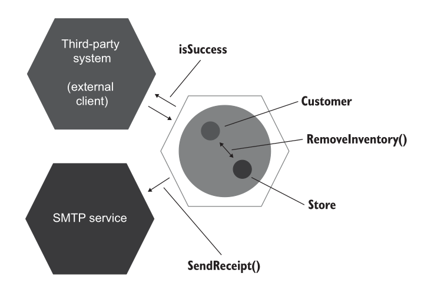

# Example 

# Directory structure
.
├── CMakeLists.txt  
├── lib  
│   ├── mail_service.hpp  
│   ├── order.hpp  
│   └── warehouse.hpp  
├── README.md  
└── tests  
    ├── order_test.cpp  
    ├── order_test_manual.cpp  
    └── order_test_real_objects.cpp  

---

# Test types
## Using real objects
g++ -std=c++17 tests/order_test_real_objects.cpp -I/usr/include -lgmock -lgtest -pthread -o order_test_real_objects

## Manually create mock
g++ -std=c++17 tests/order_test_manual.cpp -I/usr/include -lgmock -lgtest -pthread -o order_test_manual

## Use automated mock
g++ -std=c++17 tests/order_test.cpp -I/usr/include -lgmock -lgtest -pthread -o order_test
Create
g++ -std=c++17 tests/order_test.cpp -I/usr/include -lgmock -lgtest -pthread -o order_test
