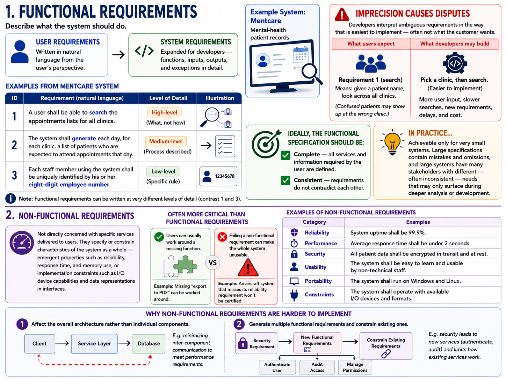

# Requirement Engineering 
- Requirements discovery and where requirements come from. 


## Requirement Engineering
The requirements for a system are the descriptions of the services that a system should provide and the constraints on its operation. The process of finding out, analyzing, documenting and checking these services and constraints is called requirements engineering (RE).  
The term requirement is not used consistently in the software industry.  
For example,  If I were to raise a contract, I might not specify exactly what I need the system to do. This leaves room for interpretation and the vendor can envision different ways to fulfill the contract.


## User requirements
User communicate their needs in the form of natural language + some diagrams. This primarily points at what the user wants the system to do.
They usually dont specify the technical details of the system.

## System requirements
System requirements are the formalized, specific, and measurable requirements that define what the system must do. For a given requirement, the system must fulfill the requirement.


## Mapping user requirements to system requirements
|User Requirement|System Requirement|
|---|---|
|1. The Mentcare system shall generate monthly management reports showing the cost of drugs prescribed by each clinic during that month.|1.1 On the last working day of each month, a summary of the drugs prescribed, their cost and the prescribing clinics shall be generated.|
||1.2 The system shall generate the report for printing after 17:30 on the last working day of the month.
||1.3 A report shall be created for each clinic and shall list the individual drug names, the total number of prescriptions, the number of doses prescribed and the total cost of the prescribed drugs.
||1.4 If drugs are available in different dose units (e.g. 10mg, 20mg, etc.) separate reports shall be created for each dose unit.
||1.5 Access to drug cost reports shall be restricted to authorized users as listed on a management access control list.|

## System stakeholders
Anyone who is genuinely interested in the system's functionality and is involved in its development and use can be considered a stakeholder.  

|User requirement|System requirement|
|---|---|
|Client managers|System end-users|
|System end-users|Client engineers|
|Client engineers|System architects|
|Contractor managers|Software developers
|System architects||

## Feasibility studies
A feasibility study is a short, focused study that should take place early in the RE process. It should answer three
key questions:   
1. Does the system contribute to the overall objectives of the organization?  
2. Can the system be implemented within schedule and budget using current technology?  
3. Can the system be integrated with other systems that are used?  

**In-class exercise:** six institute-wide system proposals that sound attractive but fail one or more of these questions. Each is a flash card — the pitch on one slide, the feasibility verdict on the next.

```slides
title: Feasibility flash cards
url_stub: lecture1-feasibility
nav:
  - lecture1_slides/01_title.md
  - lecture1_slides/02_three_questions.md
  - lecture1_slides/03_p1_pitch.md
  - lecture1_slides/04_p1_verdict.md
  - lecture1_slides/05_p2_pitch.md
  - lecture1_slides/06_p2_verdict.md
  - lecture1_slides/07_p3_pitch.md
  - lecture1_slides/08_p3_verdict.md
  - lecture1_slides/09_p4_pitch.md
  - lecture1_slides/10_p4_verdict.md
  - lecture1_slides/11_p5_pitch.md
  - lecture1_slides/12_p5_verdict.md
  - lecture1_slides/13_p6_pitch.md
  - lecture1_slides/14_p6_verdict.md
  - lecture1_slides/15_pattern.md
  - lecture1_slides/16_takeaway.md
```


## The cost of getting requirements wrong 
Poor requirements → perfect but unwanted software. 
Some notorious examples:  

| Project | What it was | The loss | The requirements failure |
|---|---|---|---|
| **UK NHS National Programme for IT** | A single electronic patient-record system for the entire UK National Health Service — the world's largest civilian IT project at the time | £12 billion; scrapped in 2011 | Requirements defined top-down; the end users (doctors, nurses) were never consulted. Vendors were locked into contracts before the complexity was understood. |
| **FBI Virtual Case File** | Software to replace the FBI's paper-based case management with a digital system for tracking investigations | Never deployed; project restarted from scratch | Vague initial requirements plus constant scope changes — no stable baseline to build against. |
| **Berlin Brandenburg Airport** | A new international airport intended to replace Berlin's two ageing airports | 9-year delay (opened 2020 instead of 2011) | Fire-safety systems designed before the scope was finalized; designs kept changing mid-construction without re-aligning stakeholders. |
| **Denver Airport Baggage System** | A fully automated baggage-handling system meant to route luggage across the airport with no human intervention | Years of manual operation; costs far beyond estimates | Requirements demanded automation beyond what the technology could actually deliver — aspiration mistaken for feasibility. |
| **Ford Edsel (1957)** | A new car brand Ford launched into the mid-priced market, backed by one of the biggest marketing campaigns of its era | $350 million lost | Market research existed but executives ignored it — requirements were a post-rationalization of a pre-decided product. |
| **Fintech AI dashboard** | An AI-powered analytics dashboard a fintech firm built for its business customers | Months of development; <5% user engagement | Requirements came from internal assumptions, not customer interviews — no prototypes, no discovery. |

Recurring pattern across these failures:  
1. **No end-user input** — you build the wrong thing perfectly (NHS, fintech dashboard).  
2. **Vague requirements + uncontrolled scope change** — rework compounds until the project collapses (FBI VCF, Berlin airport).  
3. **Requirements not grounded in evidence or feasibility** — wishes written down as specs (Denver baggage, Ford Edsel).  

Note the connection backwards to feasibility studies (these projects would have failed the three questions) and forward to elicitation: most of these losses trace to *whom you asked* and *what you validated*, not to bad engineering.


## Functional vs. non-functional requirements.

Software system requirements are often classified as:  
- **Functional requirements** — statements of services the system should provide, how it should react to particular inputs, and how it should behave in particular situations. May also state explicitly what the system should *not* do.  
- **Non-functional requirements** — constraints on the services or functions offered by the system (timing constraints, constraints on the development process, constraints imposed by standards). They usually apply to the system *as a whole* rather than to individual features.

In reality the distinction is not clear-cut. A user requirement about security ("limit access to authorized users") looks non-functional, but when developed in detail it generates clearly functional requirements (e.g. user authentication facilities). Requirements are not independent — one requirement often generates or constrains others.



### Functional requirements
Describe **what the system should do**. As user requirements they are written in natural language; as system requirements they expand these for developers — functions, inputs, outputs, and exceptions in detail.

Examples from the Mentcare system (mental-health patient records):  
1. A user shall be able to search the appointments lists for all clinics.  
2. The system shall generate each day, for each clinic, a list of patients who are expected to attend appointments that day.  
3. Each staff member using the system shall be uniquely identified by his or her eight-digit employee number.  

Note that functional requirements can be written at very different levels of detail (contrast 1 and 3).  

**Imprecision causes disputes.** Developers naturally interpret an ambiguous requirement in the way that is easiest to implement — often not what the customer wants.   
E.g. in requirement 1, medical staff expect "search" to mean: given a patient name, look across *all* clinics (confused patients may show up at the wrong clinic). Developers may instead implement "pick a clinic, then search" because it is simpler — more user input, slower searches, new requirements, delays, and cost.

Ideally the functional specification should be:  
- **Complete** — all services and information required by the user are defined.  
- **Consistent** — requirements do not contradict each other.  

In practice this is only achievable for very small systems: large specifications contain mistakes and omissions, and large systems have many stakeholders with different — often inconsistent — needs that may only surface during deeper analysis or development.

### Non-functional requirements
Not directly concerned with specific services delivered to users; they specify or constrain **characteristics of the system as a whole** — emergent properties such as reliability, response time, and memory use, or implementation constraints such as I/O device capabilities and data representations in interfaces.

They are often **more critical than individual functional requirements**: users can usually work around a missing function, but failing a non-functional requirement can make the whole system unusable (an aircraft system that misses its reliability requirement won't be certified; an embedded controller that misses its performance requirement won't control correctly).

Their implementation tends to be **spread throughout the system**, because:  
1. They may affect the overall architecture rather than individual components (e.g. minimizing inter-component communication to meet performance requirements).  
2. A single non-functional requirement (e.g. security) may generate several related functional requirements (new services) and constrain existing ones.

<!--**Classification (Figure 4.3, Sommerville):**

| Class | Source | Examples |
|---|---|---|
| **Product requirements** | Required characteristics of the software itself; constrain runtime behavior | Performance (speed, memory), reliability (acceptable failure rate), security, usability |
| **Organizational requirements** | Policies and procedures of the customer's and developer's organizations | Operational process (how the system is used), development process (programming language, environment, process standards), environmental |
| **External requirements** | Factors external to the system and its development | Regulatory (approval by e.g. a nuclear safety authority), legislative (operating within the law), ethical (acceptability to users and the public) |

Mentcare examples of each:
- *Product:* The system shall be available to all clinics during normal working hours (Mon–Fri, 08:30–17:30); downtime within working hours shall not exceed 5 seconds per day.
- *Organizational:* Users shall identify themselves using their health authority identity card.
- *External:* The system shall implement patient privacy provisions as set out in HStan-03-2006-priv.

**Goals vs. verifiable requirements.** Stakeholders often propose non-functional requirements as vague goals ("easy to use", "recovers rapidly from failure") that leave room for interpretation and later dispute:
> The system should be easy to use by medical staff and should be organized in such a way that user errors are minimized.

Rewritten as a *testable* requirement:
> Medical staff shall be able to use all the system functions after two hours of training. After this training, the average number of errors made by experienced users shall not exceed two per hour of system use.

Whenever possible, write non-functional requirements **quantitatively** so they can be objectively tested. Useful metrics (Figure 4.5, Sommerville):

| Property | Measure |
|---|---|
| Speed | Processed transactions/second; user/event response time; screen refresh time |
| Size | Megabytes; number of ROM chips |
| Ease of use | Training time; number of help frames |
| Reliability | Mean time to failure; probability of unavailability; rate of failure occurrence; availability |
| Robustness | Time to restart after failure; percentage of events causing failure; probability of data corruption on failure |
| Portability | Percentage of target-dependent statements; number of target systems |

In practice quantification is hard: some goals (e.g. maintainability) have no simple metric, customers may not relate their needs to numbers, and objective verification can cost more than customers are willing to pay.

**Conflicts and interactions.** Non-functional requirements often conflict with other functional or non-functional requirements. E.g. the identity-card requirement above needs a card reader on every computer — but a requirement for mobile access from tablets/smartphones (no card readers) forces an alternative identification method.

It is difficult to separate functional and non-functional requirements cleanly in a requirements document — stating them apart can hide the relationships between them. Still, requirements tied to emergent properties (performance, reliability) should ideally be highlighted, e.g. in a separate section or distinguished in some way.-->

## References
1. Chapter 4, Requirements Engineering, Software Engineering, Ian Sommerville
