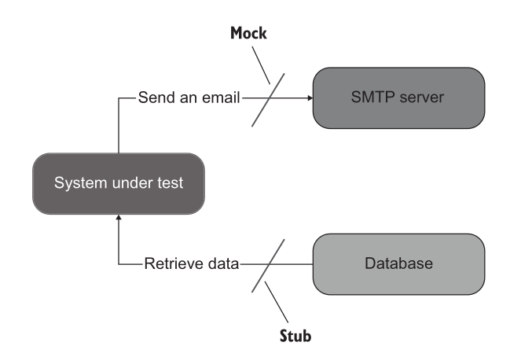
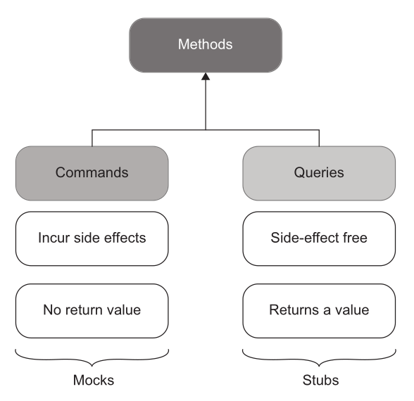
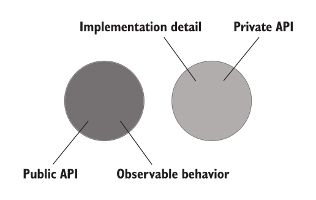
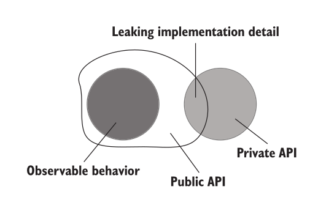
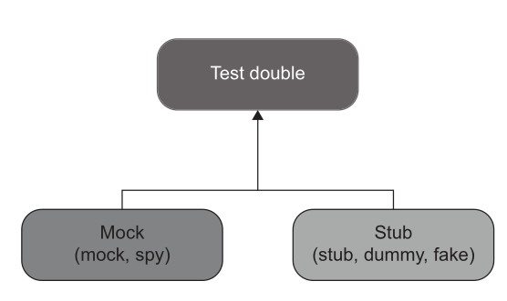

# Testing with external dependencies: test doubles, mocks vs stubs

### Quick recap
- Attributes of a good unit test
	-  Protection against regressions
	-  Resistance to refactoring
	- Fast feedback
	- Maintainability
---
### Agenda
- Testing with external dependencies

---
### Challenges with external dependencies
When your code depends on _external systems_ (databases, third-party APIs, file systems, message queues, etc.), you face a few challenges:  

- External systems can be **slow**.  
- They can be **unreliable** or rate-limited.  
- They can make tests **hard to reproduce**.  
- They can add **setup/teardown complexity**.  

---
### Strategies for Testing Code with External Dependencies
1. Abstraction via Interfaces
2. Test Doubles for Third-Party APIs
3. Using  Mocks and Stubs

---
#### Abstraction via Interfaces
- Wrap external services behind an interface or adapter.
- Your main code talks only to the interface, not directly to the external system.
- During testing, you substitute the real dependency with a **fake**, **stub**, or **mock**.


Refer example [here](../code/mock_stubs/tests/order_test_real_objects.cpp#L14)

Key idea: Order doesn't need to know which concrete warehouse or mail system it is talking to. It only depends on an interface. Tests can then provide tiny, purpose-built implementations of those interfaces.  

```
┌──────────────┐
│    Order     │
└──────┬───────┘
       │
depends on interfaces
 ┌─────┴─────----┐
 │               │
Warehouse    MailService
        │           │
┌───────┴───┐   ┌───┴────────┐
│           │   │            │
RealWarehouse  ... RealMail    ...
```

---

#### Test Doubles for Third-Party APIs
- Use libraries like **WireMock** (Java), **httpretty** (Python), or **responses** (Python) to simulate API servers.
- You predefine responses for certain requests, so tests don’t hit the real API.

---
#### Mocks and Stubs

- Mocks help to **emulate and examine outcoming interactions**. These interactions are calls the SUT makes to its dependencies **to change their state**.
- Stubs help to **emulate** incoming interactions. These interactions are calls the SUT makes to its dependencies **to get input data.** 


---
 

---
!!! question "💬 Which one is the mock?"

    The whole arrange block of `order_test.cpp`. Three dependencies, one macro, three
    times:

    ```cpp
    MockWarehouse warehouse;
    auto mailService = std::make_shared<MockMailService>();

    Order order(50, "Talisker");
    order.setMailService(mailService);

    EXPECT_CALL(warehouse, hasInventory(50, "Talisker"))   // (a)
        .Times(1)
        .WillOnce(Return(true));

    EXPECT_CALL(warehouse, remove(50, "Talisker"))         // (b)
        .Times(1);

    EXPECT_CALL(*mailService, send(_))                     // (c)
        .Times(1);

    order.fill(warehouse);

    ASSERT_TRUE(order.isFilled());
    ```

    Which of (a), (b), (c) are stubs, and which are mocks?

    ??? hint "Answer"
        **(a) is a stub.** `WillOnce(Return(true))` hands the SUT a value it needs in
        order to proceed at all. Incoming interaction. Nothing about the warehouse is
        being verified here — the test would say the same thing written as
        `ON_CALL(...).WillByDefault(Return(true))` on a `NiceMock`, which is gMock's
        actual stubbing form. Written as `EXPECT_CALL`, it quietly adds a verification
        nobody asked for.

        **(b) and (c) are mocks.** Neither returns anything. Both exist so the test can
        assert the call happened: stock left the warehouse, mail went out. Outgoing
        interactions — and the `EXPECT_CALL` *is* the assertion, which is why nothing
        after `// ACT` mentions them.

        ==The direction of the interaction decides the name, not the macro you typed.==
        One library, one syntax, two different jobs. "We use gMock" therefore tells you
        nothing about whether a test is over-mocked.

---
#### gMock in one slide

Declare the double once. Each `MOCK_METHOD` generates an override that records and
answers:

```cpp
class MockWarehouse : public Warehouse {
public:
    MOCK_METHOD(bool, hasInventory, (int, std::string), (override));
    MOCK_METHOD(void, remove,       (int, std::string), (override));
};
```

Then arrange it. Which macro you reach for is the whole decision:

| Syntax | Means | Verifies anything? |
|---|---|---|
| `ON_CALL(w, hasInventory(50, "T")).WillByDefault(Return(true))` | when asked, answer `true` | **no** — stubbing only |
| `EXPECT_CALL(w, remove(50, "T")).Times(1)` | this call must happen, exactly once | **yes** |
| `EXPECT_CALL(w, remove(_, _)).Times(0)` | this call must never happen | **yes** |
| `EXPECT_CALL(*mail, send(HasSubstr("cannot")))` | must be called with a matching argument | **yes** |
| `NiceMock<MockWarehouse> w;` | stop warning about calls you did not arrange | no |

- `_` matches any argument; `Eq`, `Ge`, `HasSubstr` match part of one.
- `WillOnce(Return(x))` answers once, `WillRepeatedly(Return(x))` answers every time.

> ==`ON_CALL` supplies input. `EXPECT_CALL` makes an assertion.== Using `EXPECT_CALL`
> when you only needed an answer is the most common way a test ends up pinned to the
> implementation rather than the behaviour.

---
### Commands vs queries
- **Commands** are methods that **produce side effects** and don’t return any value (return void).
- Examples of side effects include
mutating an object’s state, changing a file in the file system, and so on. 

- **Queries** are side-effect free and **return a value**.

---


---
#### The rule is easy to break

An earlier version of `Order::fill`, in this course's own example:

```cpp
bool fill(Warehouse&);      // removes stock, sends mail — and returns a value
```

It changes state *and* answers a question, so it belongs to both columns at once. The
return value was redundant as well: `isFilled()` already exposed the same fact, and every
test asserted it twice.

```cpp
void fill(Warehouse&);      // command
bool isFilled() const;      // query
```

==A method that is both is a method you cannot decide how to double.==

---
#### Commands and queries in a real code base

Same repo as the test-double examples later in this lecture.

**Command** — [`record_gemini_failure`](https://github.com/Piyushtanwani/DAU-buddy/blob/b909c221fcccb069f3ff9eb40e8292b435145d8a/api/services/gemini.py#L41-L46). Returns
`None`, writes two module globals. Nothing to read back:

```python
def record_gemini_failure() -> None:
    global _gemini_healthy, _gemini_last_check
    _gemini_healthy = False
    _gemini_last_check = time.time()
```

**Query** — [`compute_free_slots`](https://github.com/Piyushtanwani/DAU-buddy/blob/b909c221fcccb069f3ff9eb40e8292b435145d8a/api/services/timetable_service.py#L59-L75). Busy
rows in, free `"HH:MM-HH:MM"` gaps out. No database, no globals, inputs untouched. Call it
a thousand times and nothing in the system moves.

---
#### The same repo breaks the rule twice

[`is_gemini_available`](https://github.com/Piyushtanwani/DAU-buddy/blob/b909c221fcccb069f3ff9eb40e8292b435145d8a/api/services/gemini.py#L26-L38) is named like a query, typed
`-> bool`, and documented as *"Returns True if Gemini is currently considered reachable"*:

```python
def is_gemini_available() -> bool:
    global _gemini_healthy, _gemini_last_check
    if not _gemini_healthy:
        if time.time() - _gemini_last_check < _GEMINI_COOLDOWN:
            return False
        _gemini_healthy = True        # the query writes
    return True
```

==Asking the question changes the answer.== Once the cooldown expires, the first call
flips the flag back to healthy. [`chat.py`](https://github.com/Piyushtanwani/DAU-buddy/blob/b909c221fcccb069f3ff9eb40e8292b435145d8a/api/routes/chat.py#L426-L445) calls it
three times in one request path, so calls two and three see a system the first call
altered.

---
#### And once harmlessly

[`fetch_all_faculty_context`](https://github.com/Piyushtanwani/DAU-buddy/blob/b909c221fcccb069f3ff9eb40e8292b435145d8a/api/services/faculty_service.py#L27-L66) also assigns a
global from inside a query — it memoises the formatted block it just built.
[`clear_faculty_cache`](https://github.com/Piyushtanwani/DAU-buddy/blob/b909c221fcccb069f3ff9eb40e8292b435145d8a/api/services/faculty_service.py#L20-L24) is the command that
resets it.

| Query | Writes global | Can a caller tell? |
|---|---|---|
| `compute_free_slots` | no | — |
| `fetch_all_faculty_context` | yes, a cache | no — same answer either way |
| `is_gemini_available` | yes, the flag it reports on | **yes** |

> ==The rule is not "a query must not write". It is "a query must not change the answer
> anyone gets next."== A cache is invisible. A state machine is not.

The middle row is why `Order::fill` returning `bool` mattered: not because returning a
value is forbidden, but because it made one method answerable in two ways that could
drift apart.

---
!!! question "💬 Stub it or mock it?"

    Six methods from the warehouse example. For each one: command or query — and in a
    test, would you stub it or mock it?

    `hasInventory` · `getInventory` · `remove` · `send` · `fill` · `isFilled`

    ??? hint "Answer"
        | Method | Kind | In a test |
        |---|---|---|
        | `Warehouse::hasInventory` | query | **stub** — hand it the answer the test needs |
        | `Warehouse::getInventory` | query | **stub**, or assert on it for state |
        | `Warehouse::remove` | command | **mock** — assert the call happened |
        | `MailService::send` | command | **mock / spy** |
        | `Order::fill` | command | the operation under test |
        | `Order::isFilled` | query | what you assert on |

        ==Query → stub. Command → mock.== One rule, nothing to memorise — and it only
        works while every method is one or the other.

---
###  Code separation
- All production code can be categorized along two dimensions:
-  **Public API vs. private API** (where API means application programming interface)
-  **Observable behavior vs. implementation details**

---
#### Public vs private API
Usually differentiated by public methods of a class vs private, protected members

---
#### Observable behaviour vs implementation detail
- For a piece of code to be part of the system’s observable behavior, it has to do one of the following things:
	-  **Expose an operation that helps the client achieve one of its goals.** An operation is a method that performs a calculation or incurs a side effect or both.
	-  **Expose a state that helps the client achieve one of its goals.** State is the current condition of the system.  
- Any code that does neither of these two things is an implementation detail.

---
!!! question "💬 Public, but is it observable?"

    A `User` class exposes two public members: a `Name` property, and a
    `NormalizeName(string)` method. The client's goal is to rename a user.

    Which of the two is observable behaviour?

    ??? hint "Answer"
        Only `Name`. Renaming is the goal; normalising is a *step inside* it.
        `NormalizeName` neither completes an operation the client wants nor exposes state
        the client needs, so by the rule above it is an implementation detail.

        Public **and** an implementation detail is exactly what a leak is. The client is
        now obliged to call it, in the right order, before every write — and any test
        written against it breaks the moment normalisation moves elsewhere.

---
#### Well designed API


---
#### Leaky API design


---
#### example leaky design 
```c#
public class User
{
	public string Name { get; set; }
	public string NormalizeName(string name){
		string result = (name ?? "").Trim();
		if (result.Length > 50){
			return result.Substring(0, 50);
		}
	return result;
}
}
```

```c#
public class UserController{
	public void RenameUser(int userId, string newName){
		User user = GetUserFromDatabase(userId);
		//string normalizedName = user.NormalizeName(newName);
		user.Name = normalizedName;
		SaveUserToDatabase(user);
}
}
```

---
### Types of test double
- **Dummy** objects are passed around but never actually used. Usually they are just used to fill parameter lists.
- **Fake** objects actually have working implementations, but usually take some shortcut which makes them not suitable for production (an [in memory database](https://martinfowler.com/bliki/InMemoryTestDatabase.html) is a good example).
- **Stubs** provide canned answers to calls made during the test, usually not responding at all to anything outside what's programmed in for the test.
- **Spies** are mocks that also record some information based on how they were called. One form of this might be an email service that records how many messages it was sent.
- **Mocks** are the objects pre-programmed with expectations which form a specification of the calls they are expected to receive.
---


---

!!! question "💬 The comments in that file are wrong"

    `order_test_real_objects.cpp` labels both of its replacement classes `SPY`.
    `WarehouseImpl` keeps inventory in an `unordered_map`. `ConsoleMailService` appends to
    a `sentMessages` vector.

    Are both of them spies?

    ??? hint "Answer"
        One is.

        - `ConsoleMailService` is a **spy**. It records how it was called, and the
          recording *is* the assertion:
          `EXPECT_EQ("Order filled for Talisker", mailService->sentMessages[0])`.
        - `WarehouseImpl` is a **fake**. It is a working in-memory implementation, not a
          recorder. The test asserts on final state —
          `EXPECT_EQ(0, warehouse.getInventory(TALISKER))` — never on which calls arrived.

        ==A fake has an implementation. A spy has a notebook.== Classify by what the test
        asserts on, not by what the comment claims.

---
### Test doubles in a real code base

Python rather than gMock, but each double is the one named above.

**Spy** — [`calendar_calls`](https://github.com/Piyushtanwani/DAU-buddy/blob/b909c221fcccb069f3ff9eb40e8292b435145d8a/tests/test_timetable_mcp_day_resolution.py#L22-L32) replaces `effective_day` with a function that appends to a list before returning a canned answer. The tests then assert on *how many times it was called*:

- `test_defaulting_to_today_resolves_the_day_once` → exactly one lookup.
- `test_an_explicit_day_needs_no_calendar_at_all` → zero lookups.

Every `effective_day` is a database round trip, and these tools once made three of them per answer. ==The output was correct all three times — only the count was wrong.== No assertion on the *result* could have caught that.

That is a spy in Fowler's sense: a stub that also records how it was called, and the recording *is* the assertion.

---
Two classes further down, the identical fixture is a plain **stub**.
[`test_venue_with_no_sessions_still_reports_the_substitution`](https://github.com/Piyushtanwani/DAU-buddy/blob/b909c221fcccb069f3ff9eb40e8292b435145d8a/tests/test_timetable_mcp_day_resolution.py#L62-L68) requests
`calendar_calls`, never looks at the list, and asserts on the returned message instead:

```python
msg = asyncio.run(tt.get_venue_schedule("CEP-209", date="2026-08-07"))

assert "Tuesday" in msg
assert "treated as" in msg
```

Here the canned `("Tuesday", "Friday")` only exists to push the code down its
substituted-day path. Same object, two roles.

> ==The double does not decide whether it is a spy. The assertion does.==

---
**Stub** — [`no_sessions`](https://github.com/Piyushtanwani/DAU-buddy/blob/b909c221fcccb069f3ff9eb40e8292b435145d8a/tests/test_timetable_mcp_day_resolution.py#L35-L40) returns canned empty lists so the code under test takes its empty-result path. Nothing is asserted about the stub itself.

**Stub of an external dependency** — [`mock_db`](https://github.com/Piyushtanwani/DAU-buddy/blob/b909c221fcccb069f3ff9eb40e8292b435145d8a/tests/test_timetable_service.py#L17-L27) hands back a fake cursor whose `fetchall()` returns whatever rows the test names. It lets [`test_exact_match_wins_over_longer_substring_match`](https://github.com/Piyushtanwani/DAU-buddy/blob/b909c221fcccb069f3ff9eb40e8292b435145d8a/tests/test_timetable_service.py#L42-L58) pin a real regression with no database anywhere.

---

### Where over-mocking bites

[`test_threshold_is_never_set_session_wide`](https://github.com/Piyushtanwani/DAU-buddy/blob/b909c221fcccb069f3ff9eb40e8292b435145d8a/tests/test_fuzzy_directory_search.py#L133-L144)

- Loop inside loop inside `if`, over `MagicMock` call records.
- If no recorded call matches `set_config`, **zero assertions run and the test still passes**.
- Asserting on interactions rather than state is what makes this possible.

---
!!! question "💬 It is green. What has it proved?"

    That test walks a `MagicMock`'s recorded calls looking for `set_config`, and asserts
    inside the loop. It passes.

    What does the pass tell you?

    ??? hint "Answer"
        Nothing. If no recorded call matches `set_config`, the loop body never runs, no
        assertion executes, and the test reports success.

        This is `CoversEverything` from Lecture 7-8 wearing a disguise — production code
        runs, nothing is checked. There the assertions were plainly missing. Here they
        exist; they are simply unreachable.

        ==A test that can pass without asserting is not a test.== Loops and `if`s over
        mock call records are how that stays hidden.

---

Worked examples from [DAU-buddy](https://github.com/Piyushtanwani/DAU-buddy), pinned at commit [`b909c22`](https://github.com/Piyushtanwani/DAU-buddy/tree/b909c221fcccb069f3ff9eb40e8292b435145d8a).


---
### Exercise: three doubles, one behaviour

`docs/code/mock_stubs/tests/` holds three files. All three run the same two tests against
the same `Order`, and all three pass.

| File | How the warehouse is replaced |
|---|---|
| `order_test_real_objects.cpp` | hand-written classes, used directly |
| `order_test_manual.cpp` | hand-written double that records calls |
| `order_test.cpp` | gMock, `EXPECT_CALL` |

Now refactor `Order::fill` without changing what it does:

```cpp
if (warehouse.getInventory(item) >= quantity) {   // was: hasInventory(quantity, item)
```

!!! question "💬 Name the double in each file. Which suites still pass?"

    ??? hint "Answer"
        One passes, two fail.

        | File | Doubles | After the refactor |
        |---|---|---|
        | `order_test_real_objects.cpp` | fake + spy | **passes** |
        | `order_test_manual.cpp` | hand-rolled mock | fails — `Actual: false / Expected: true` |
        | `order_test.cpp` | gMock mock | fails — `remove(50, "Talisker")` **never called** |

        The fake implements the whole interface, so it does not care which method the SUT
        chose. The other two were built around `hasInventory` specifically: the manual
        double hard-codes `getInventory` to return `0`, so the SUT now receives wrong
        input, and gMock's `EXPECT_CALL` pins a call that no longer happens.

        ==Behaviour unchanged, two suites red.== That is the second attribute from the
        recap slide — resistance to refactoring — measured on one page. The gMock suite is
        not wrong; it is paying for interaction detail this test did not need.

---
!!! question "💬 Now your own snake game. What would you test?"

    Take your Lab 1 implementation. Name three things worth a unit test and three that
    are not. Then, for each one you would test, decide whether it needs a test double at
    all.

    ??? hint "Answer"
        No single right list, but there is a shape.

        **No double needed — pure logic, and the easiest tests you will ever write.**

        | What | Why it is testable as it stands |
        |---|---|
        | `checkSelfCollision()` | body positions in, `bool` out — a query |
        | `grow()`, then length | command, then query: arrange a body, act, assert the length |
        | rejecting a reversal | turning back into yourself is a rule, not a drawing |
        | score after eating | arithmetic over state the test controls |

        22 of your 36 repos have a `checkSelfCollision` or `checkCollision`. Almost none
        of them are tested, because the rule is tangled into the render loop where a test
        cannot reach it.

        **Double needed — the world outside the rules.** Counted across the 36 repos:

        | Dependency | Repos | Double |
        |---|---|---|
        | `getch` / `kbhit` — keyboard | 31 / 28 | **stub** — feed a scripted key sequence |
        | `Sleep` / `sleep_for` — clock | 28 | **stub**, or your suite takes real seconds |
        | `rand` / `srand` — food placement | 22 / 20 | **stub** — pin where the next fruit lands |
        | `system("cls")` — screen | 18 | **spy**, if you assert on drawing at all |
        | high-score file | 17 | **fake** — an in-memory store |

        ==If you cannot replace these, you cannot test the game — and that is a design
        finding, not a testing problem.== A `rand()` called from the middle of `Logic()`
        has no seam to replace. That is the subject of Lecture 13-14.

        **Not worth testing.**

        - The exact characters drawn. Change a border glyph, break a test.
        - A getter that exists only so the renderer can diff the last frame against this
          one. That is the optimisation, not the behaviour.
        - That `Setup()` ran before `Logic()`. Assert the outcome, not the call order.

        > ==Test the rules of the game. Stub the world it runs in. Ignore how it looks.==

---


### References
1. [Chapter 5, Unit Testing, Principles Practices and Patterns by Vladimir Khorikov](https://www.manning.com/books/unit-testing) 
2. [Mocks Aren't Stubs](https://martinfowler.com/articles/mocksArentStubs.html)
3. [gMock for Dummies | GoogleTest](https://google.github.io/googletest/gmock_for_dummies.html)
4. [gMock Cookbook | GoogleTest](https://google.github.io/googletest/gmock_cook_book.html)
5. [gMock Cheat Sheet](https://android.googlesource.com/platform/external/googletest/+/refs/heads/main-cg-testing-release/docs/gmock_cheat_sheet.md)
 
---
