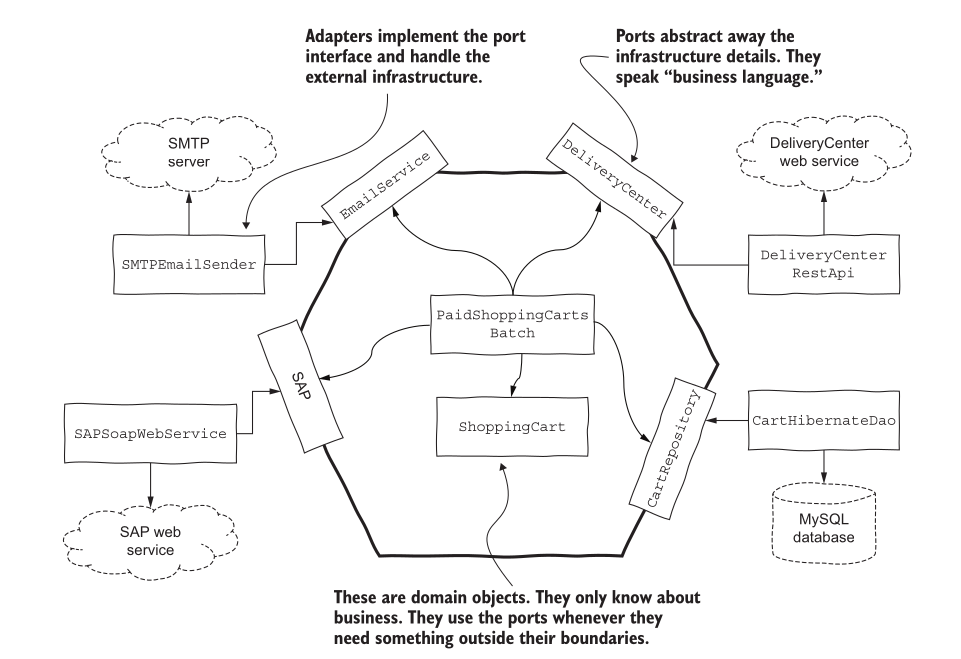
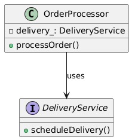
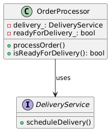

# Testability and design

## Quick recap
- How to derive test cases?
	- Specification testing
	- Boundary testing
	- Structural testing

---
## The claim

Everything that follows argues for two sentences:

> 1. ==Untestable code is a design smell.== The difficulty is the symptom. The defect is
>    in the design.
> 2. ==Making code testable is not the same as improving it.== You can always force a
>    test to become possible. That usually leaves the design worse.

The first is easy to accept. The second is where the work is, so start there.

---
## Testability and design 

- **Iceberg class** — one method above the waterline, five below.

| **RuleEvaluator**       |
| ----------------------- |
| + evaluate(rule)        |
| - _parse_adjunct_term() |
| - _parse_factor_term()  |
| - _parse_adjunct()      |
| - _has_more_tokens()    |
| - _get_next_token()     |

It evaluates rule strings like `"active AND premium OR trial"`. The leading `_` is
Python's marker for private — the same thing the `-` says in the diagram:

```python
class RuleEvaluator:

    def evaluate(self, rule):                 # the only way in
        self.source   = rule
        self.position = 0
        return self._parse_adjunct()

    def _has_more_tokens(self):   ...         # skip separators, anything left?
    def _get_next_token(self):    ...         # read up to the next separator

    def _parse_adjunct(self):      ...        # OR  level
    def _parse_adjunct_term(self): ...        # AND level
    def _parse_factor_term(self):  ...        # a single term
```

Testability: not good.

---
### Why not

Five of the six methods are private. ==The only door into this class is
`evaluate(rule)`, and the only thing that comes back is one boolean.==

```python
# the test you want
assert tokens_of("active\tAND\tpremium") == ["active", "AND", "premium"]

# the test you can write
assert RuleEvaluator().evaluate("active\tAND\tpremium") is False
```

The second assertion is worth almost nothing:

- **When it fails**, you do not know why. A tokenizer that does not treat a tab as a
  separator fails it. So does an `AND` that got its precedence wrong. So does a typo in
  `_parse_factor_term`. One boolean cannot separate five methods.
- **When it passes**, it does not tell you the tokenizer is right. It tells you the whole
  pipeline happened to agree on this one string.

To corner a tokenizer bug you must invent rule strings until one of them makes the final
answer flip — reasoning backwards through four other methods to design each input.

> ==The pain is not that the tests are hard to write. It is that they cannot be aimed.==

---
### Fix 1
Make private function public.
Testable? Yes. Good design?

| **RuleEvaluator**       |
| ----------------------- |
| + evaluate(rule)        |
| - _parse_adjunct_term() |
| - _parse_factor_term()  |
| - _parse_adjunct()      |
| + has_more_tokens()     |
| - _get_next_token()     |

```python
class RuleEvaluator:

    def evaluate(self, rule):
        self.source   = rule
        self.position = 0
        return self._parse_adjunct()

    def has_more_tokens(self): ...            # underscore dropped. now public
    def _get_next_token(self): ...
```

The test is now possible — and look at what it costs:

```python
e = RuleEvaluator()
e.evaluate("active\tAND\tpremium")           # must run first: it sets self.source
assert e.has_more_tokens() is False
```

==You cannot call the public method until you have called the other public method.== The
class now advertises that it holds a parse position, and every client — not only the test
— is free to read it mid-parse.

---
!!! question "💬 It is testable now. Is it better?"

    Fix 1 cost one keyword and bought a test. Name what the class gave up.

    ??? hint "Answer"
        Three things, none of which the test needed.

        - **A promise it cannot keep.** `has_more_tokens()` is public, so it is part of
          the contract now. Tokenizing can no longer change without breaking callers you
          have never met.
        - **An object that is only half usable.** Call it before `evaluate()` and it reads
          a position nobody set. The class has acquired an order of operations and no way
          to state it.
        - **Nothing on the diagnosis.** The test still cannot ask *"does this tokenizer
          split on tabs?"* It can only watch a parse already in flight.

        ==Fix 1 is available for every untestable class you will ever meet.== A private
        method made public, a field exposed, a setter added for tests only. The suite goes
        green every time, and the design is worse every time.

---

### Root cause
1. Code violates Single Responsibility Principle

| **RuleEvaluator**           |
| --------------------------- |
| ==+ evaluate(rule)==        |
| **- _parse_adjunct_term()** |
| **- _parse_factor_term()**  |
| **- _parse_adjunct()**      |
| *+ has_more_tokens()*       |
| *- _get_next_token()*       |

Highlighted: the one thing this class was asked to do. **Bold**: parsing. *Italic*:
tokenizing. Two jobs in one box.

---

| **RuleEvaluator**       |
| ----------------------- |
| + evaluate(rule)        |
| - _parse_adjunct_term() |
| - _parse_factor_term()  |
| - _parse_adjunct()      |

| RuleTokenizer       |
| ------------------- |
| + has_more_tokens() |
| + get_next_token()  |

```python
class RuleTokenizer:

    def __init__(self, source):               # arrives complete
        self.source   = source
        self.position = 0

    def has_more_tokens(self): ...
    def get_next_token(self):  ...


class RuleEvaluator:

    def evaluate(self, rule):
        self._tokens = RuleTokenizer(rule)    # held privately
        return self._parse_adjunct()

    def _parse_adjunct(self):      ...
    def _parse_adjunct_term(self): ...
    def _parse_factor_term(self):  ...
```

And the test you actually wanted, three slides ago:

```python
t = RuleTokenizer("active\tAND\tpremium")

assert [t.get_next_token() for _ in range(3)] == ["active", "AND", "premium"]
```

No rule string to reverse-engineer, no `evaluate()` call to prime the object, and a
failure names exactly one method.

- The `RuleTokenizer` class now has a clean, public interface (`has_more_tokens`, `get_next_token`), making it independently testable.  
    - The original `RuleEvaluator` holds a private instance of the `RuleTokenizer`, maintaining its external encapsulation.  
    - This new structure adheres to SRP, resulting in smaller, more focused, and more maintainable classes. The testability problem disappears as a side effect of improving the design.  
    
---

### What that sequence showed

- **Fix 1** made the class testable and made it worse. The test could now reach
  `has_more_tokens()` — and so could every other client.  
- **Extracting `RuleTokenizer`** made it testable and made it better. Nobody was aiming at
  testability; it was an SRP fix, and the testability arrived as a side effect.  

==Both routes end at "now I can test it". Only one of them is a fix.==

---

## Seven testing pains, and what each one is really telling you

Every pain below is a complaint about the design. The flaw in the middle column already
had a name before unit testing existed; the right-hand column is the rest of this lecture.

| # | The testing pain | The design flaw underneath | Fix |
|---|---|---|---|
| 1 | **Difficult setup** — instantiating one class drags in half the application | Excessive coupling | smaller, cohesive units with fewer dependencies |
| 2 | **State leaks** — tests fail intermittently, or poison the next test | Global mutable state, unmanaged lifecycle | own your resources; no singletons |
| 3 | **Framework frustration** — logic welded to a GUI, web or persistence framework | Insufficient separation of concerns | §1 — infrastructure vs domain |
| 4a | **Difficult mocking** — a fake returns a fake that returns a fake | Law of Demeter — `a.getB().getC().getD()` | shorten the chain |
| 4b | **Difficult mocking** — the dependency cannot be substituted at all | Dependency Inversion — you depend on a concrete class | §2 — dependency injection |
| 5 | **Hidden inputs and effects** — input arrives from nowhere, effects vanish into a database | Encapsulation violation; the class does more than it says | §1 — separate computation from I/O |
| 6 | **Unwieldy parameter lists** — twelve arguments to call one method | Too many responsibilities | split the class |
| 7 | **Test thrash** — one small change breaks thirty tests | Open/Closed violation, poor locality | extend by substitution, not modification |

---
!!! question "💬 Which row is your snake game?"

    Open your Lab 1 repository. Pick the function you would least like to write a test
    for, and find its row in the table above.

    ??? hint "Answer"
        Most of you will land on the same handful.

        | If your worst function… | Row | Because |
        |---|---|---|
        | calls `getch()` or `rand()` inside the game rules | 5 | the input arrives from somewhere no test can reach |
        | reads or writes a global board, score or direction | 2 | two tests in one binary now share state |
        | draws the frame and decides the rules in one pass | 3 | you cannot have the rule without the screen |
        | is `main()`, or something `main()`-shaped at 200 lines | 1 and 6 | nothing can be constructed on its own |

        ==Not one of those rows says "add a test".== Each names a change to the production
        code you would want anyway, and the test becomes possible as a consequence.

---
<!--### Two of those rows are not new

**Row 7** is *resistance to refactoring* from Lecture 9-10, seen from the other side. There
it was an attribute you scored a test on. Here it is a defect you fix in the production
code. ==Same phenomenon, and the test suite is not the thing to change.==

**Row 4b** is why Lecture 11-12 worked at all. `Order` took an abstract `Warehouse&`, so
the test could hand it a fake. A `Order` that constructed its own `SqlWarehouse` would
have been untestable, and the four techniques below are how you avoid writing that class.

> ==Notice what is absent from the middle column: "this code has no tests". Every flaw
> listed is one you would want fixed even if you never wrote a single test.==-->

---
## Designing for Testability

### 1. Separate infrastructure code from domain code (at architectural level)

#### The rule cannot run without a database

```python
class InvoiceFilter:

    def _all(self):                               # infrastructure
        conn     = DatabaseConnection("invoices_db", "root")
        invoices = conn.execute_query("SELECT * FROM invoices")
        conn.close()
        return invoices

    def low_value_invoices(self):                 # the business rule
        result = []
        for inv in self._all():                   # <- cannot run without a database
            if inv.value < 100:
                result.append(inv)
        return result
```

The rule is "an invoice below 100 is low value". Four lines above it decide that you
cannot ask that question without a live connection.

---
#### Known issues:
- Domain code and infrastructure code are mixed. This means we will not be able to avoid database access when testing the low-value invoices rule.
- The more responsibilities, the more complexity, and the more chances for bugs. Classes that are less cohesive contain more code.

---
#### What a seam is

Michael Feathers named this in *Working Effectively with Legacy Code*:

> A **seam** is a place where you can alter behaviour in your program **without editing
> in that place**.

Two halves, and the second is the one people miss:

- the **seam** — where the substitution takes effect
- the **enabling point** — where you choose what to substitute

==A seam with no enabling point is not a seam.== If the only way to swap the database is
to edit `_all()`, the test cannot do it.

---
#### Not every call is a seam

This is the test, and it is why the enabling point is in the definition.

```python
class Checkout:
    def confirm(self, order):
        gateway = StripeGateway(api_key=LIVE_KEY)   # the class is decided here
        gateway.charge(order.total)                 # ...so this is not a seam
```

You have a very good reason to want that last line replaced: ==running this test charges
a real card.== And you cannot. `charge` is a method call on an object, it looks
substitutable, and it is not — the concrete class was fixed one line above, inside the
method. Nothing outside can reach it.

The only ways out are to edit `confirm`, or to ship a test-mode flag into production
code. Both change the program to suit the test.

```python
class Checkout:
    def __init__(self, gateway):                    # <- enabling point
        self._gateway = gateway

    def confirm(self, order):
        self._gateway.charge(order.total)           # ...and now it is a seam
```

The call did not change. ==What changed is that somewhere else can now decide.== A
parameter on `confirm` would work just as well; what matters is only that the decision
moved outside the method.

---
#### The test that was impossible one slide ago

```python
from unittest.mock import Mock

def test_confirm_charges_the_order_total():
    gateway = Mock() # charges nothing, records everything

    checkout = Checkout(gateway) # modify behavior via mock
    checkout.confirm(Order(total=250))

    gateway.charge.assert_called_once_with(250) # the test asserts the call, not the return value
```

Four lines, and every one of them was unavailable before the seam existed:

- **no card, no API key, no network.** The test runs in microseconds
- it asserts the **amount**. The real gateway would only ever have told you it succeeded
- it asserts **once**. Charge twice and the test fails:
  `Expected 'charge' to be called once. Called 2 times.`
- nothing in `Checkout` changed to make this possible — ==the production path still
  constructs a real `StripeGateway` and still charges real cards==

`charge` is a command: it changes the world and returns nothing worth reading. ==You
cannot check a command by its return value. You check it by watching the call.==

---

!!! question "💬 Seam or not? And if it is, where is the enabling point?"

    Five lines. For each one: can behaviour there be replaced without editing there —
    and if so, where does the decision live?

    | | Code | Seam? | Enabling point |
    |---|---|---|---|
    | a | `conn = psycopg2.connect(...)` then `conn.execute(sql)` | | |
    | b | `def run(self, conn): conn.execute(sql)` | | |
    | c | `datetime.now()`, called inside the method | | |
    | d | `self._clock.now()`, clock set in `__init__` | | |
    | e | `requests.get(url)`, module imported at the top | | |

    ??? hint "Answer"
        | | Seam? | Enabling point |
        |---|---|---|
        | a | **no** | none — the connection was built one line up, in the same scope |
        | b | yes | the argument list |
        | c | **no** | none — the call reaches straight out to the clock |
        | d | yes | the constructor call |
        | e | yes, technically | the module attribute — somebody else reassigns `requests.get` |

        **(e) is the one that should bother you.** It is a seam, and a bad one. The
        enabling point is *"some other module reached in and reassigned an attribute"* —
        nothing at the call site says so. That is the same objection as the link seam,
        in a language with no linker.

        Note that **c and d are the same call**. The only difference is whether anybody
        else was given a chance to decide.

---
#### Three kinds, in descending order of dignity

Feathers classifies them by *what* does the swapping:

| Kind | Swapped at | Cost |
|---|---|---|
| **Object seam** | run time, by passing a different object | cheap, reversible, the one you want |
| **Link seam** | build time, by linking a different binary | whole-binary granularity |
| **Preprocessing seam** | compile time, by `#define` | last resort |

==A design offers object seams. A desperate test manufactures the other two.==

Watch for the third one when you read somebody's tests. It is a confession.

---
#### One call, three seams

One line is the whole problem. `send_email` talks to a mail server; a test must not.

```c
void confirm_order(const char *customer) {
    save(customer);
    send_email(customer, "Your order is confirmed");   /* <- this */
}
```

Three ways to stop it, ==and none of the three edits this function.==

---
#### Seam 1: preprocessing

Replace the text before the compiler ever sees it.

```c
/* testdefs.h */
#ifdef TESTING
extern const char *last_to;
#define send_email(to, body)  (last_to = (to))
#endif
```

```c
void send_email(const char *to, const char *body);

#include "testdefs.h"      /* after the declaration, never before */
```

| | |
|---|---|
| **Seam** | the `send_email` call |
| **Enabling point** | `-DTESTING`, a compiler flag |

Put the include above the declaration and the macro rewrites the declaration too, and
nothing compiles. ==A seam you can install backwards is a seam you will install
backwards.==

---
#### Seam 2: link

Leave the call alone. Give the linker a different function to resolve it to.

```c
/* stub_mailer.c — compiled into the test build in place of mailer.c */
void send_email(const char *to, const char *body) { }
```

```bash
cc order.c mailer.c       -o app      # production
cc order.c stub_mailer.c  -o tests    # test
```

| | |
|---|---|
| **Seam** | the unresolved `send_email` reference |
| **Enabling point** | the build script |

Nothing in the source says any of this is happening. ==Read `order.c` all day and you
will not learn that the mail is fake.==

---
#### Seam 3: object

Stop calling a free function. Take the mailer as an argument.

```cpp
void confirm_order(const string &customer, Mailer &mailer) {
    save(customer);
    mailer.send(customer, "Your order is confirmed");
}
```

| | |
|---|---|
| **Seam** | `mailer.send(...)` |
| **Enabling point** | the argument list |

---
#### The same three, side by side

| | Enabling point | Granularity | Visible in the source? |
|---|---|---|---|
| Preprocessing | `-DTESTING` | whole build | no |
| Link | the build script | whole binary | no |
| **Object** | the argument list | **per test** | **yes** |

Only the third lets one test binary hold two different mailers. The first two are decided
once, for everything, somewhere the reader is not looking.

==The question is never whether a seam exists. It is which one you can afford to live
with.==

Note what Python, Java and C# do **not** have: a preprocessor, and a linker you can point
elsewhere. Two of these three rows are a C and C++ inheritance. ==The one language family
that gives you extra seams is the one that most needs them.==

---

!!! question "💬 Make this one testable. Change behaviour by nothing."

    ```cpp
    class OrderService {
    public:
        void confirm(const string &customer) {
            save(customer);
            send_email(customer, "Your order is confirmed");   // free function
        }
    };
    ```

    You may not rewrite `confirm`. You may not change what the program does. Add as
    little as you can get away with, and say where the enabling point ends up.

    ??? hint "Answer"
        Add a method to the class with the same signature as the free function, and have
        it forward:

        ```cpp
        class OrderService {
        public:
            void confirm(const string &customer) {
                save(customer);
                send_email(customer, "Your order is confirmed");   // now resolves to the member
            }
        protected:
            virtual void send_email(const string &to, const string &body) {
                ::send_email(to, body);                            // the real one
            }
        };
        ```

        `confirm` is untouched. The call now resolves to the member rather than the free
        function, and the member does exactly what the free function did. **Behaviour is
        identical.** Then subclass it in the test and override `send_email` to do nothing.

        - **Seam** — the `send_email` call, unchanged.
        - **Enabling point** — which class the test instantiates.

        The same trick has a second form: a private static method becomes overridable by
        dropping `static` and widening it to `protected`. Both are one-line changes that
        create an enabling point where there was none.

        ==You do not need the design to be right. You need one place where the decision
        can move.==

---

!!! question "💬 One of you wrote this. Where is the seam?"

    From [`dudhatmonar/snake-game-cpp`](https://github.com/dudhatmonar/snake-game-cpp/blob/f9428f408be81893f22de5f4a737e1f4f2286b9a/snake_game.cpp#L192-L201):

    ```cpp
    void saveHighScore() {
        if (score > highScore) {
            ofstream outFile(HIGH_SCORE_FILE);
            if (outFile.is_open()) {
                outFile << score;
                outFile.close();
                highScore = score;
            }
        }
    }
    ```

    Three questions, in order:

    1. What rule does this function implement?
    2. Where is the enabling point today?
    3. One branch here cannot be reached by any test. Which, and why?

    ??? hint "Answer"
        **1. The rule.** *A high score is recorded only when it is beaten.* An equal score
        must not overwrite. Whether that should be `>` or `>=` is a real boundary
        question — and nobody can settle it with a test today.

        **2. There is none.** `ofstream outFile(HIGH_SCORE_FILE)` builds the collaborator
        inside the method, and `HIGH_SCORE_FILE` is a file-scope `const string`.
        Construction in the same scope, so nothing outside gets to decide — the same
        shape as `StripeGateway(api_key=LIVE_KEY)`.

        The cost is immediate: the test writes `score.txt` into the working directory, and
        the second test reads whatever the first one left there.

        **3. `if (outFile.is_open())` has no `else`.** When the file will not open,
        `highScore = score` never runs. The object keeps the old value while the caller
        believes the save succeeded. To reach that branch you must make a write fail on
        demand, and ==you cannot make a real `ofstream` fail on demand.==

        One way to install the seam:

        ```cpp
        void saveHighScore(ScoreStore &store) {          // <- enabling point
            if (score > highScore) {
                if (store.write(score)) {
                    highScore = score;
                }
            }
        }
        ```

        A fake `ScoreStore` can now refuse the write. ==The argument for the seam was
        never convenience. That branch is already in the code, already wrong, and
        currently unreachable.==

---

!!! question "💬 This author injected four things. Name the fifth."

    From [`divyesh-dandwani/Snake-Game-CPP`](https://github.com/divyesh-dandwani/Snake-Game-CPP/blob/205fd2aea17acea256a39ee3edfbd822bf0b6440/snake_gamebox.cpp#L193-L237):

    ```cpp
    Point generateFood(int w, int h, const vector<Point> &snake, const vector<Point> &blocks) {
        ...
        while (!ok && attempts < 1000) {
            f.x = rand() % (w - 4) + 2;
            f.y = rand() % (h - 4) + 2;
            if (!inside(f))                 { attempts++; continue; }
            if (occupied(f))                { attempts++; continue; }
            if (freeNeighborCount(f) < 2)   { attempts++; continue; }
            ok = true;
        }
    ```

    Board size, snake and obstacles all arrive as parameters. What does not — and what
    does that cost?

    ??? hint "Answer"
        **`rand()`.** Everything the function needs was handed to it except the one thing
        that decides the answer.

        ==Partial injection is not a beginner's mistake. It is what happens when you pass
        in the things you were already passing around, and stop at the one that feels like
        part of the language.==

        There is a real rule on that third condition: *food never spawns anywhere with
        fewer than two free neighbours*, so it never appears in a dead end. That is a
        deliberate design decision, and no test can check it — not because it is hard, but
        because nobody can choose what `rand()` returns.

        One parameter fixes it:

        ```cpp
        Point generateFood(int w, int h, const vector<Point> &snake,
                           const vector<Point> &blocks, function<int()> next_random);
        ```

        Then a test scripts the sequence, aims the first draw straight at a dead end, and
        asserts the function rejected it.

---
#### The object seam, at full size

`confirm_order` took a mailer and the slide fit in four lines. Here is the same move on a
real domain class — and this time the seam is not rescuing a call, it is ==the thing that
separates the rule from the infrastructure.==

```python
class InvoiceRepository(Protocol):
    def all(self) -> list[Invoice]: ...


class InvoiceFilter:

    def __init__(self, repo: InvoiceRepository):  # the seam
        self._repo = repo

    def low_value_invoices(self):
        result = []
        for inv in self._repo.all():
            if inv.value < 100:
                result.append(inv)
        return result
```

The rule did not change. `self._all()` became `self._repo.all()`. ==Everything that made this class
untestable lived in the four lines that fetched the data, never in the rule itself.==

---
#### The test you could not write before

```python
repo           = InMemoryInvoices([("A", 50), ("B", 120), ("C", 90)])
invoice_filter = InvoiceFilter(repo)

assert invoice_filter.low_value_invoices() == [("A", 50), ("C", 90)]
```

No connection string, no schema, no rows to seed, no cleanup. `InMemoryInvoices` is a
**fake** in the Lecture 11-12 sense — a working implementation that takes a shortcut
unfit for production.

> ==The class was never hard to test. It was hard to reach.==

---
#### A bigger one: four collaborators

Suppose an online web shop has the following requirements. For all the shopping carts
that were paid today, the system should

- Set the status of the shopping cart as ready for delivery, and persist its new state in the database.
- Notify the delivery center, and let them know they should send the goods to the customer.
- Notify the SAP system.
- Send an e-mail to the customer confirming that the payment was successful. The e-mail should contain an estimate of when delivery will happen. The information is available via the delivery center API.

---

```python
class ShoppingCartRepository(Protocol):
    def carts_paid_today(self) -> list[Cart]: ...
    def persist(self, cart) -> None: ...

class DeliveryCenter(Protocol):
    def deliver(self, cart) -> date: ...

class CustomerNotifier(Protocol):
    def send_estimated_delivery_notification(self, cart) -> None: ...

class SAP(Protocol):
    def cart_ready_for_delivery(self, cart) -> None: ...


class PaidShoppingCartsBatch:

    def __init__(self, db, delivery_center, notifier, sap):   # four seams
        self._db, self._delivery_center = db, delivery_center
        self._notifier, self._sap       = notifier, sap

    def process_all(self):
        for cart in self._db.carts_paid_today():
            estimated_day = self._delivery_center.deliver(cart)
            cart.mark_as_ready_for_delivery(estimated_day)
            self._db.persist(cart)
            self._notifier.send_estimated_delivery_notification(cart)
            self._sap.cart_ready_for_delivery(cart)
```

Four dependencies, four interfaces, one constructor. ==`process_all` performs no I/O of its
own — it only decides the order in which four collaborators are called.== That ordering is
the entire domain rule, and a test can now watch it happen with four fakes.

---


---
#### What you use a seam for

Two jobs, and they need different substitutes.

| | Goal | What the substitute must do |
|---|---|---|
| **Separation** | stop unwanted behaviour running | nothing. An empty function is enough |
| **Sensing** | see what the code did, when the effect is otherwise invisible | record the calls and their arguments |

==A stub separates. A spy senses.== The seam is what lets either one be installed.

Start sensing with the simplest recording you can, and let it grow only as far as the
assertions force it.

---

!!! question "💬 Three tests. What does each one tell you about the code it tests?"

    No commentary, just the opening lines. Read them as evidence.

    ```python
    # A
    @patch("billing.stripe.Charge.create")
    def test_refund_is_capped(mock_create):
    ```

    ```cpp
    // B
    #define main snake_main
    #include "../test.cpp"
    ```

    ```python
    # C
    svc = OrderService(mailer=FakeMailer())
    ```

    ??? hint "Answer"
        | | What the test had to do | What the design offered |
        |---|---|---|
        | **A** | reach past the code and patch a name inside a third-party module | no seam of its own — it borrowed Python's |
        | **B** | rename the entry point and swallow the whole file | nothing, at any of the three stages |
        | **C** | pass an argument | a seam, deliberately |

        A is the interesting one. It works, it is common, and it is still a report: the
        code under test named `stripe` directly, so the test had to know that too. Rename
        the dependency and the test breaks without a single behaviour changing.

        B is what happens when the answer is *none of the three* — covered on the next
        slide.

        > ==A test is a receipt for what the design would not give it.==

        Read your own tests this way and you never need to ask whether a design is
        testable. The tests already said.

---

!!! question "💬 Which seam did your snake game leave you?"

    Open your own repository. Find where you read the clock, the keyboard, or the random
    number generator. Ask what you would have to change to substitute it — and *where*
    that change would live.

    ??? hint "Answer"
        For almost all of you the honest answer is **none of the three**.

        A link seam needs the dependency to be behind a function you link against. A
        preprocessing seam needs the call to come through a header you can shadow. An
        object seam needs something to pass in. A direct `getch()` in the middle of a
        loop, in a single translation unit, offers no substitution point at any of the
        three stages.

        That is why the harness for this course had to rename `main` and swallow the
        whole file. ==When a design offers no seam, the test does not get to stop
        needing one — it just has to buy a worse one.==

---
### 2.  Dependency injection and Controllability
- Controllability
	- We should be able to control what a class under test does?
- Dependency Injection
	- All external dependencies should be passed into a class (e.g. via its constructor or setter methods) rather than hard-coded inside it.
	- By coding to an abstraction rather than a concrete class, unit tests can “plug in” a stub or a fake. What supplies the abstraction is a language detail — a `Protocol`, an abstract base class, an interface, or a plain callable passed in.

---
#### In the snake game

`getch()` appears in 32 of your 36 repos, called from inside the loop it drives:

```python
class Game:
    def step(self):
        key = read_key()               # the real keyboard. nothing can control it
        ...
```

Pass it in instead:

```python
class Game:
    def __init__(self, read_key):
        self._read_key = read_key

    def step(self):
        key = self._read_key()
```

```python
keys = iter(["a", "a", "w"])           # a scripted player
g    = Game(read_key=lambda: next(keys))

g.step(); g.step(); g.step()           # left, left, up
```

==That is controllability: the test decides what the player does.== Without the seam, the
only way to exercise a left turn is for a human to press a key.

---
### 3. Make classes and methods observable
Observability, at the class level, is about how easy it is to assert that the behavior of the functionality went as expected. 
Ensure that your classes provide developers with simple and easy ways to assert their state.  
Common way:  
- Introducing methods to facilitate assertions  
- void methods are hard to test and can be improved by making them return some assertable value instead  

Example:

| Aspect          | Not-so-good design                                                                                                                                                                                                                                        | Good design                                                                                                                                                                                                     |
| --------------- | --------------------------------------------------------------------------------------------------------------------------------------------------------------------------------------------------------------------------------------------------------- | --------------------------------------------------------------------------------------------------------------------------------------------------------------------------------------------------------------- |
| Diagram         |                                                                                                                                                                                                         |                                                                                                                                                                      |
| **Testability** | - The only way to verify behavior is to **spy** on `scheduleDelivery()`.<br>    <br>- If someone refactors the internals (e.g., calls a helper method), test breaks even though externally behavior is same → brittle.  <br>- No direct observable state. | - Test checks behavior through **observable program state**, not implementation details.<br>    <br>- No mocking or spying needed for verification.<br>    <br>- Easier to read, maintain, and refactor safely. |

---
#### In the snake game

`grow()` returns nothing, so a test can only spy on it or reach into a private field:

```python
class Snake:
    def grow(self):                    # void. did anything happen?
        self._growing = True
```

Add the query the game loop wants anyway:

```python
class Snake:
    def grow(self):   ...
    def length(self): return len(self._body)
```

```python
s = Snake(body=[(5, 5), (5, 6)])
s.grow()
s.step(UP)

assert s.length() == 3
```

==One method to add, and the test stops caring how growth is implemented.==

---

---
!!! question "💬 Make one snake method observable"

    The table above says: verify through state, not by spying. In most of your repos a
    collision is detected inside `logic()` and acted on immediately — a global flag is
    set, or `game_over()` is called, or something is printed.

    What would you add so a test can assert a collision *without* spying on anything?

    ??? hint "Answer"
        A query. The collision already happens; nothing exposes the result.

        ```python
        class Snake:
            def step(self, direction): ...     # command — moves, may die
            def is_alive(self):        ...     # query   — the addition
        ```

        ```python
        s = Snake(body=[(0, 5)], board=(20, 20))
        s.step(LEFT)                           # walks into the wall

        assert s.is_alive() is False
        ```

        No spy, no screen scraping, no global to reset between tests. This is the
        command/query split from Lecture 11-12, used as a design tool rather than a
        classification.

        > ==One caution: this is not a licence to add a getter per private field.==
        > `is_alive()` is observable behaviour — the game loop already needs it to know
        > when to stop. A getter that only a test would ever call is Fix 1 wearing a
        > different hat.

---


---
### 4. Dependency via class constructor or value via method parameter
- Receiving a dependency via constructor adds a little complexity to the overall class and its tests but simplifies its client classes. 
- Receiving the data via method parameter simplifies the class and its tests but adds a little complexity to the clients. 

```python
class Game:

    def __init__(self, place_fruit, board):   # dependency — fixed for this Game
        self._place_fruit = place_fruit
        self._board       = board

    def step(self, direction):                # data — different every tick
        ...
```

```python
g = Game(place_fruit=lambda: (5, 5), board=(20, 20))   # once
g.step(UP)                                             # per call
g.step(LEFT)
```

==If it varies per call, pass it per call. If it is fixed for the object's life, pass it
once.== The fruit placer is a dependency; the direction is data.

## Testability in a real code base

### The rule that cannot run without a database

[`get_day_substitution`](https://github.com/Piyushtanwani/DAU-buddy/blob/b909c221fcccb069f3ff9eb40e8292b435145d8a/api/services/calendar_service.py#L33-L52) answers a domain
question — *which weekday does campus actually run on this date?* It opens its own
connection to do it:

```python
def get_day_substitution(date_str):
    query = "SELECT event_name FROM academic_calendar WHERE ..."
    with db_connection() as conn:                 # infrastructure, inside the rule
        with conn.cursor() as cur:
            cur.execute(query, (date_str, date_str))
            return _parse_day_substitution([r[0] for r in cur.fetchall()])
```

Same shape as `InvoiceFilter._all()`. Rows 3 and 5 of the pains table.

Lecture 11-12 showed the workaround: the [`mock_db`](https://github.com/Piyushtanwani/DAU-buddy/blob/b909c221fcccb069f3ff9eb40e8292b435145d8a/tests/test_timetable_service.py#L17-L27)
fixture reaches in from outside and patches `db_connection` for the duration of a test.

> ==That is a seam cut by the test, not offered by the design.== Monkeypatching is what
> you reach for when technique §1 was never applied.

---
### Three flaws in nine lines

[`is_gemini_available`](https://github.com/Piyushtanwani/DAU-buddy/blob/b909c221fcccb069f3ff9eb40e8292b435145d8a/api/services/gemini.py#L26-L38) decides whether to call the
model or fall back to local NLP:

```python
_gemini_healthy    = True                         # module-level mutable state
_gemini_last_check = 0.0

def is_gemini_available() -> bool:
    global _gemini_healthy, _gemini_last_check
    if not _gemini_healthy:
        if time.time() - _gemini_last_check < _GEMINI_COOLDOWN:   # reads the clock
            return False
        _gemini_healthy = True                    # a query that writes
    return True
```

| What it does | Pains row | Cost in a test |
|---|---|---|
| module-level mutable state | 2 — state leaks | one test that records a failure changes the next test's answer |
| calls `time.time()` directly | 5 — hidden input | you cannot test the cooldown without sleeping 60 seconds |
| writes the flag it reports on | — | asking twice gives two different answers |

Technique §2 fixes all three at once — hold the state in an object, inject the clock:

```python
class GeminiCircuit:

    def __init__(self, clock, cooldown=60.0):     # clock is now a seam
        self._clock, self._cooldown = clock, cooldown
        self._healthy, self._last_check = True, 0.0

    def is_available(self): ...
    def record_failure(self): ...
```

A test hands it `lambda: 1000.0`, records a failure, hands it `lambda: 1061.0`, and
asserts recovery. No sleeping, no globals, no ordering between tests.

---
### 36 snake games

Lecture 11-12 counted the untestable dependencies across your repos: `getch` in 31,
`Sleep` in 28, `rand` in 22, the screen in 18, a high-score file in 17.

The reason none of them can be stubbed is not the language. It is *where* the call sits:

```python
def logic():                                  # 22 of 36 repos, shape varies
    ...
    if head == fruit:
        score += 10
        fruit = (rand() % width, rand() % height)      # no seam
```

Technique §4 — pass the value in through the method — costs one parameter:

```python
def logic(place_fruit):
    ...
    if head == fruit:
        score += 10
        fruit = place_fruit()
```

```python
logic(place_fruit=lambda: (5, 5))             # the fruit lands where the test says
```

==Nothing about the game changed. The rule became reachable.==

---

---
## Back to the claim

> **Untestable code is a design smell.**

Every pain in this lecture had a design flaw underneath it, and each flaw already had a
name before unit testing existed: coupling, global state, mixed concerns, Demeter, DIP,
SRP, OCP. ==None of them were invented to make testing easier.== A test is simply the
cheapest place to notice them, because it is the first client of your code whose
requirements you control completely.

> **Making code testable is not the same as improving it.**

Fix 1 is always available. Make the private method public, expose the field, add a setter
nobody needs, hand the test a back door. The suite goes green and the design is worse
than when you started.

The four techniques are the whole difference: each one makes the code testable **by**
removing the coupling rather than routing around it.

==If a change made your code easier to test and harder to explain, you did Fix 1.==

---
## References:
1. [Michael Feathers - the deep synergy between testability and good design - YouTube](https://youtu.be/4cVZvoFGJTU?list=TLGG0KwbRmmxQHswMzExMjAyNQ)
2. Chapter 7, Designing for Testability "Effective Software testing by MAURÍCIO ANICHE"
3. Chapter 4, The Seam Model — *Working Effectively with Legacy Code*, Michael Feathers
