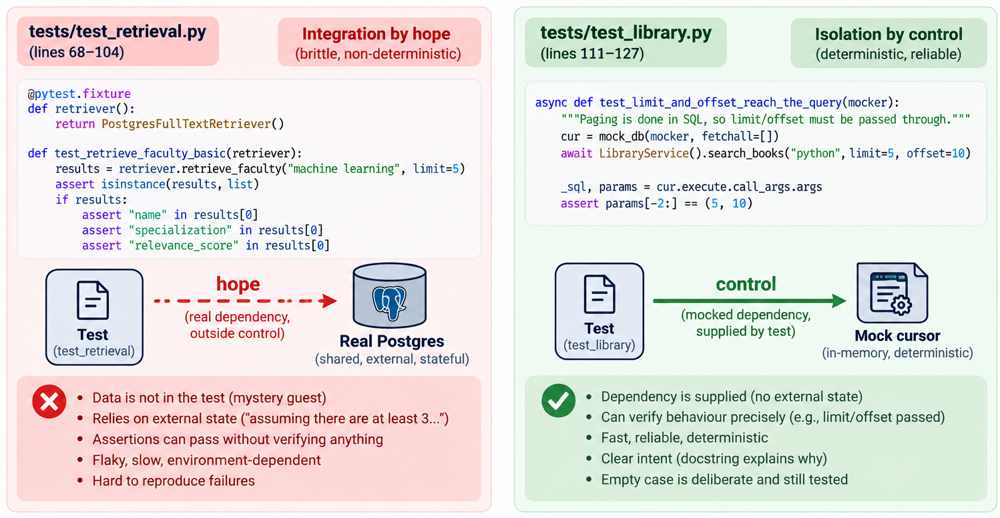
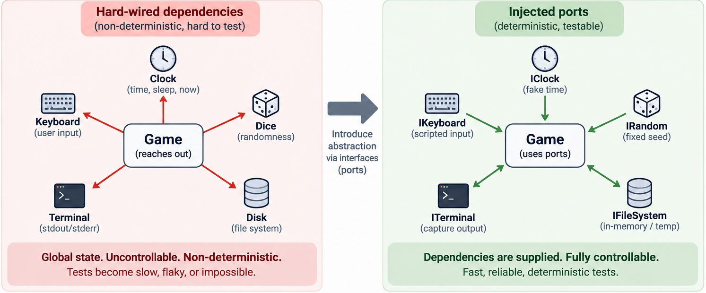

# Test code quality

## Quick recap
- Untestable code is a design smell
- Seams: where a test can substitute behaviour, and the enabling point that lets it
- Controllability and observability

---
## The claim

Everything that follows argues for two sentences:

> 1. ==Test code is code.== It rots the same way production code rots, and for the same
>    reasons.
> 2. ==A suite you have stopped trusting is worse than no suite.== No suite is an absence.
>    An untrusted suite is a cost you keep paying for a guarantee you no longer believe.

The first is easy to accept and easy to forget. The second is what makes the first
matter.

---
### Agenda

- Test code is code
- Five smells, with instances
- Determinism: the clock, the dice, the keyboard
- Tests that pass without testing anything
- Fixtures, and what they reveal about the design

---

## 1. Test code is code

You wrote a test once. You will read it every time it fails, and every time you are not
sure whether it failed for a real reason.

- Production code is read to find out **what the system does**.
- Test code is read under pressure, at the worst moment, to find out **whether you are
  in trouble**.

A test that cannot answer that question quickly has failed at its job even when it is
green.

> ==Write the test for the person who will read it at 6pm on a Friday.==

---
#### Forty-three lines, four tests, five smells

The whole file — [`tests/test_retrieval.py`](https://github.com/Piyushtanwani/DAU-buddy/blob/b909c221fcccb069f3ff9eb40e8292b435145d8a/tests/test_retrieval.py):

```python
@pytest.fixture
def retriever():
    return PostgresFullTextRetriever()

def test_retrieve_faculty_basic(retriever):
    """Test retrieving faculty returns a list of dictionaries with correct keys."""
    results = retriever.retrieve_faculty("machine learning", limit=5)
    assert isinstance(results, list)
    if results:
        assert "name" in results[0]
        assert "specialization" in results[0]
        assert "relevance_score" in results[0]

def test_retrieve_respects_limit(retriever):
    """Test that the retrieval limits are respected."""
    # Assuming there are at least 3 faculties in DB
    results = retriever.retrieve_faculty("a", limit=2)
    assert len(results) <= 2
```

---
#### What each line costs

| Line | Smell | Why it hurts |
|---|---|---|
| `PostgresFullTextRetriever()` | **Mystery guest** | The data it depends on is not in the file. It is in a database, on a machine, seeded by someone. |
| `# Assuming there are at least 3 faculties in DB` | **Resource optimism** | The assumption is written down and unenforced. A comment is not a fixture. |
| `assert isinstance(results, list)` | **Vague assertion** | Passes on an empty list. Passes if retrieval is deleted and replaced with `return []`. |
| `if results:` | **Conditional assert** | Covered in 7-8. An empty database turns three assertions into zero. |
| `len(results) <= 2` | **Assertion that cannot fail usefully** | Zero is `<= 2`. The limit is never actually tested. |

Run this against an empty database. Four tests pass. ==Nothing has been verified.==

---
#### The same repository, done well

[`tests/test_library.py`](https://github.com/Piyushtanwani/DAU-buddy/blob/b909c221fcccb069f3ff9eb40e8292b435145d8a/tests/test_library.py) — 19 tests, four classes, one behaviour each:

```python
async def test_limit_and_offset_reach_the_query(self, mocker):
    """Paging is done in SQL, so limit/offset must be passed through."""
    cur = mock_db(mocker, fetchall=[])
    await LibraryService().search_books("python", limit=5, offset=10)

    _sql, params = cur.execute.call_args.args
    assert params[-2:] == (5, 10)
```

- The dependency is **supplied**, not hoped for.
- The docstring says *why the test exists*, not what the code does.
- `fetchall=[]` — the empty case is deliberate here, and the assertion still bites.

Same code base. Same team. The difference is not skill.

---

!!! question "💬 Two suites, one repository. What is actually different?"

    `test_retrieval.py` and `test_library.py` were written against the same kind of
    thing: a service that runs SQL and returns rows. One is worthless, one is good.

    Name the single decision that separates them.

    ??? hint "Answer"
        **One of them controls its dependency. The other hopes for it.**

        Every smell in the table follows from that. Once the database is real and
        unseeded, you *cannot* write a sharp assertion — you do not know what is in
        there. So you soften: `isinstance`, `if results:`, `<= 2`. Each softening is
        locally reasonable and the sum is a suite that verifies nothing.

        ==The vague assertions are not the disease. They are the symptom of an
        uncontrolled dependency.== This is 13-14 again, arriving from the other side:
        the missing seam shows up first as a bad test, not as bad code.

        

---
## 2. Five smells

---
#### Mystery guest

The test depends on something it does not show you.

[`test_seed_timetable.py`](https://github.com/Piyushtanwani/DAU-buddy/blob/b909c221fcccb069f3ff9eb40e8292b435145d8a/tests/test_seed_timetable.py#L371):

```python
pytest.skip("data/Lab Data.xlsx not present")
```

Honest about it, which is better than most. But the behaviour is still: on your machine
the test runs, on mine it vanishes, and the suite reports success either way.

**Fix:** build the input in the test, or commit a small fixture file next to it.

---
#### Resource optimism

The test assumes an environment it did not create.

[`test_fuzzy_directory_search.py`](https://github.com/Piyushtanwani/DAU-buddy/blob/b909c221fcccb069f3ff9eb40e8292b435145d8a/tests/test_fuzzy_directory_search.py#L714-L717):

```python
@pytest.fixture
def patched_db(self):
    import psycopg2
    conn = psycopg2.connect(**_DB_KWARGS)   # a real server, right here
```

This is a legitimate integration test. The problem is that it sits in the same suite,
behind the same command, as the unit tests — so one unavailable server makes the whole
run red and people learn to ignore red.

**Fix:** separate the run. Not the technique — the *button*.

---
#### General fixture

One `SetUp` serving every test, most of it unused by any single one.

`snake_test.cpp`:

```cpp
class SnakeTest : public ::testing::Test {
protected:
    void SetUp() override { stub::reset(); lup = 0; sc = 0; run = true; }
};
```

`lup`, `sc`, `run` are file-scope globals in the game. The fixture is not organising the
test — it is **undoing the previous test**.

> ==A fixture that resets globals is a design report, not a test utility.==

Compare the DAU-buddy version, where `mock_db(mocker, fetchall=...)` takes an argument
because each test wants different rows. One is a helper. The other is a cleanup crew.

---
#### Eager test

[`test_timetable_mcp_availability.py`](https://github.com/Piyushtanwani/DAU-buddy/blob/b909c221fcccb069f3ff9eb40e8292b435145d8a/tests/test_timetable_mcp_availability.py) — 198 lines. **One** test function.

It builds an in-memory SQLite database, inserts a timetable, patches a service, runs the
overlap query, and asserts. When it goes red you have 198 lines and no idea which of
them is the reason.

**Fix:** the arrangement is fine. Split the *acts*.

---
#### Assertion roulette

A test with many bare assertions and no messages. It fails at line 42 and the report
says: line 42.

```python
assert result["total_matches"] == 10       # which one broke?
assert result["showing"] == "1-1"
assert result["more_available"] is True
```

Here the names are self-describing, so it is survivable. It stops being survivable when
the values are positional, or the same assertion runs in a loop.

**Fix:** name the thing, or assert on a whole structure at once so the diff shows you
everything that moved.

---
## 3. Determinism

A test that can fail without the code changing is not a test. It is a rumour.

Across the 36 snake repositories:

| Dependency | Repos |
|---|---|
| `sleep` / `Sleep()` / `sleep_for` | 36 |
| `getch()` | 32 |
| `kbhit()` | 30 |
| `rand()` | 30 |
| `srand()` | 30 |
| `system("cls")` / `system("clear")` | 25 |
| `fstream` | 22 |

Every one of these is a hard-coded dependency on something the test cannot control:
the clock, the dice, the keyboard, the terminal, the disk.

==This is why none of these repositories have tests.== Not because nobody tried. Because
there was nothing to hold.

---
#### The same picture, twice



The left panel is every repository in the table above. The right panel is what the
harness in this lecture had to build before it could test one.

Nothing on the right is cleverer. The arrows point the other way, and that is the
whole difference.

---
#### What the harness did about it

```cpp
stub::time = 0.5;
EXPECT_TRUE(eventTrigger(0.3));
EXPECT_DOUBLE_EQ(lup, 0.5);
```

```cpp
stub::randomValues = {0,0, 5,7};   // first (0,0) is on snake -> retry
Food f({{0,0},{1,0}});
EXPECT_EQ(f.p.x, 5); EXPECT_EQ(f.p.y, 7);
```

```cpp
stub::keys = {{KEY_UP,true},{KEY_DOWN,true},{KEY_LEFT,true},{KEY_RIGHT,true}};
```

A scripted clock, scripted dice, a scripted player. The second one is the good test in
the file: it proves the *retry* branch — that a fruit landing on the snake is rejected —
and it can only prove it because the dice are scripted.

That is 13-14 §2 arriving as a fact rather than a slide.

---

!!! question "💬 Your snake uses `rand()`. Prove fruit never spawns on the snake."

    The rule is one line of code and everybody has it. Write the test.

    ??? hint "Answer"
        You cannot, and the reason is not the test.

        With `rand()` called inside `place_fruit()`, the only available test is *"run it
        five hundred times and check it never happened."* That test is slow, it is
        probabilistic, and when it fails it cannot tell you which call did it.

        Inject the source of randomness and the test becomes three lines with an exact
        expected value — the `stub::randomValues` example above.

        ==The untestable part was never the rule. It was the dependency the rule reached
        out and grabbed.==

---
## 4. Tests that pass without testing

The most expensive test is not the one that fails. It is the one that has never
failed and never could.

---
#### Read this one carefully

```cpp
TEST_F(SnakeTest, MainLoopKeyPresses) {
    // 4 frames, each with a different key; direction rules exercised
    stub::framesUntilClose = 4;
    stub::randomValues = {10,10};
    stub::keys = {{KEY_UP,true},{KEY_DOWN,true},{KEY_LEFT,true},{KEY_RIGHT,true}};
    EXPECT_EQ(snake_main(), 0);
}
```

The comment says the direction rules are exercised. They are — the code runs.

**Nothing about direction is asserted.** The only assertion is that `main` returned `0`.

So delete the rule. All four guards, in the game:

```cpp
if(IsKeyPressed(KEY_UP)    && (s.direction.y!=1))   ->  if(IsKeyPressed(KEY_UP))
if(IsKeyPressed(KEY_DOWN)  && (s.direction.y!=-1))  ->  if(IsKeyPressed(KEY_DOWN))
if(IsKeyPressed(KEY_LEFT)  && (s.direction.x!=1))   ->  if(IsKeyPressed(KEY_LEFT))
if(IsKeyPressed(KEY_RIGHT) && (s.direction.x!=-1))  ->  if(IsKeyPressed(KEY_RIGHT))
```

The snake can now reverse into itself. Rebuild and run:

```
[==========] 19 tests from 1 test suite ran.
[  PASSED  ] 19 tests.
```

Not one test noticed. Not just `MainLoopKeyPresses` — ==the entire suite is blind to a
rule the game cannot be played without.==

Coverage goes up. Verification does not exist.

> ==It can only confirm that the code does what it does.==

---
#### Leaking the implementation into the test

```cpp
// Head starts at x==1 moving right. With time advancing 1s per frame every
// frame triggers an update, so the head reaches x==cellcount on frame 24.
stub::framesUntilClose = 30;
```

The test encodes an arithmetic derivation about the game's internals — the head must
reach the wall inside the 30 frames the test allows.

Widen the board and re-run. `cellcount` is a pure configuration constant; no behaviour
changes:

| `cellcount` | Result |
|---|---|
| 25 (as shipped) | 19 passed |
| 29 | 19 passed |
| 31 | 19 passed |
| **32** | **`MainLoopHitsRightWallAndResets` fails** |
| 35 | same one fails |

Nothing broke at 32. The snake simply ran out of frames before reaching the wall, so
`go()` was never called and the score was never reset.

The test has a **silent tolerance window** — it holds to 31 and not past it. That number
appears nowhere. Nobody chose it. It is a side effect of `framesUntilClose = 30`.

That is a **false positive**: red without a defect. `Lecture9_10.md` called it the worse
of the two failures, and this is what it looks like in the wild.

**Fix:** assert the *event*, not the frame count. Run until the wall is hit, then check.

---
#### The assertion that was weakened to make it pass

```cpp
EXPECT_GE(stub::soundPlays, 1);        // wall sound
```

`GE` where `EQ` was meant. Somebody wrote `EXPECT_EQ(stub::soundPlays, 1)`, it failed
because the loop played the sound twice, and the fastest green was to relax the operator.

Now the test passes if the wall sound plays once, or forty times.

> ==Every weakened assertion is a bug report somebody chose not to read.==

---
#### Testing private methods

DAU-buddy does this four times:

| Test | Calls |
|---|---|
| [`test_calendar.py#L127`](https://github.com/Piyushtanwani/DAU-buddy/blob/b909c221fcccb069f3ff9eb40e8292b435145d8a/tests/test_calendar.py#L127) | `calendar_service._parse_day_substitution()` |
| [`test_chat_guardrails.py#L43`](https://github.com/Piyushtanwani/DAU-buddy/blob/b909c221fcccb069f3ff9eb40e8292b435145d8a/tests/test_chat_guardrails.py#L43) | `gemini._extract_function_calls()` |
| [`test_seed_timetable.py#L263`](https://github.com/Piyushtanwani/DAU-buddy/blob/b909c221fcccb069f3ff9eb40e8292b435145d8a/tests/test_seed_timetable.py#L263) | `seed_timetable._parse_section_header()` |
| [`test_seed_timetable.py#L296`](https://github.com/Piyushtanwani/DAU-buddy/blob/b909c221fcccb069f3ff9eb40e8292b435145d8a/tests/test_seed_timetable.py#L296) | `seed_timetable._filter_meta()` |

The usual rule says do not test private methods. Apply it here and you delete some of
the best tests in the repository.

---

!!! question "💬 Four tests call a `_private` function. Which rule is wrong?"

    Either the tests are wrong, or the rule is, or the code is. Pick one and defend it.

    ??? hint "Answer"
        **The underscore is wrong.**

        Look at what all four have in common: they are pure functions. String in, tuple
        out. No state, no I/O, no collaborators.

        And they have real edge cases. `_parse_section_header` does not just split a
        string — it *normalises* the programme name, and the workbook it parses ships
        with typos:

        | Input | Output |
        |---|---|
        | `"BTech (MnC) Core: SEMESTER III"` | `("B Tech (MnC)", 3)` |
        | `"BTech (ICT &  CS) Elective: SEMESTER V (2024 Batch)"` | `("B Tech (ICT and CS)", 5)` |
        | `"MSc (DS) Coe : SEMESTER III (2025 Batch)"` | `("MSc (DS)", 3)` |
        | `"Some New Programme: TERM 2"` | `(None, None)` |

        `BTech` becomes `B Tech`. `&` becomes `and`. `Coe` is a typo for `Core` and is
        tolerated. One test is named `test_longest_key_wins` because `BTech` is also a
        key and the more specific match has to take precedence.

        A pure function with its own input space and its own edge cases is **a unit**.
        The `_` says "implementation detail of this module", and for these four it is a
        lie — they have a contract worth stating and worth protecting.

        The rule is right about *why*: do not reach into a class to observe state the
        public interface deliberately hides. That is the Fix 1 anti-pattern from 13-14.
        These four are not that. They are a module that has not yet admitted what its
        interface is.

        ==Ask whether the thing has a contract, not whether it has an underscore.==

---
## 5. Fixtures

Two fixtures, from the two code bases:

```python
def mock_db(mocker, *, fetchall=None, fetchone=None):
    """Point library_service.db_connection at a mock cursor."""
```

```cpp
void SetUp() override { stub::reset(); lup = 0; sc = 0; run = true; }
```

| | `mock_db` | `SetUp` |
|---|---|---|
| Takes arguments | yes — each test asks for its own rows | no |
| What it does | supplies a dependency | resets globals |
| If the design improved | unchanged | unnecessary |

> ==A fixture that would disappear if the design were better is telling you about the
> design.==

`mock_db` is not going anywhere; injecting a cursor is what the test *wants* to do.
`SetUp` exists only because `lup`, `sc` and `run` are file-scope mutable state, and it
will exist for exactly as long as they are.

---

!!! question "💬 Open a test you have written. Which row of the catalogue is it?"

    Not a trick question. Pick one test, name the smell, name the fix. If you cannot
    find a smell, name the assertion that would fail if you deleted the feature.

    ??? hint "What to look for"
        - Does it touch a file, a clock, a network, or a database it did not create?
        - Delete the feature it tests. Does it go red?
        - Change something cosmetic — a rename, a constant. Does it go red?
        - How many behaviours does it check?
        - When it fails, does the message tell you what broke?

        The second and third are the important ones, and they pull in opposite
        directions. A test must fail when behaviour changes and must not fail when it
        does not. ==Most bad tests fail the first check. The expensive ones fail the
        second.==

---
## Back to the claim

Every smell in this lecture traces to one of two roots.

| Root | Smells it produces |
|---|---|
| **The dependency could not be controlled** | mystery guest, resource optimism, vague assertion, conditional assert, general fixture |
| **The assertion was written to pass, not to catch** | weakened operator, leaked implementation detail, no assertion at all |

The first root is 13-14's subject arriving one lecture late: a missing seam shows up as a
bad test before it shows up as bad code.

The second is nobody's design failing. It is what happens when a red build is an
obstacle instead of information.

> ==Test code is code — and a suite you have stopped trusting is worse than no suite,
> because you are still paying for it.==

---
## References:

1. Chapter 10, Test Code Quality — *Effective Software Testing*, Maurício Aniche
2. Chapter 11, Test Code Smells and Anti-patterns — *Effective Software Testing*, Maurício Aniche
3. [xUnit Test Patterns — test smells catalogue](http://xunitpatterns.com/Test%20Smells.html), Gerard Meszaros
