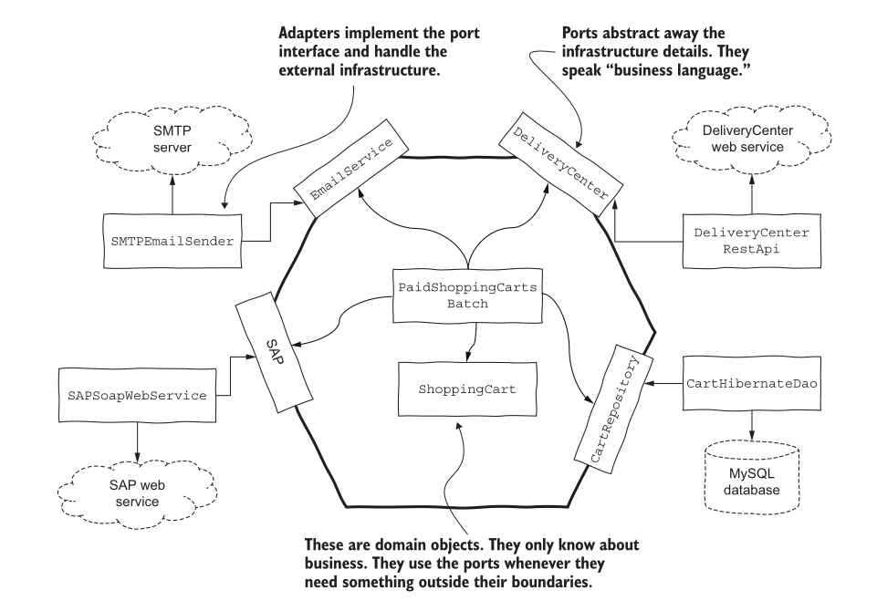

# Architecture: boundaries

## Quick recap
- SOLID — principles for one class
- Component principles — what ships together, and which way components point

---
## The question

Where does **design** end and **architecture** begin?

Hold that. It gets answered at the end.

---
## Four scales

| Scale | Unit | Asks |
|---|---|---|
| Code | a function | can a reader follow this? |
| Class | one class | what makes it change? |
| Component | a group of classes | which way do dependencies point? |
| **System** | the whole thing | **what is inside the boundary?** |

This lecture is the top row.

---
## Start with a small system

A snake game that remembers the high score.

```python
class Game:
    def finish(self, score):
        best = json.load(open("score.json"))["best"]
        if score > best:
            json.dump({"best": score}, open("score.json", "w"))
```

Works. Ships. Now three change requests arrive.

---
#### Change request 1

*"Store scores in a database, not a file."*

What do you edit? **`Game`.**

---
#### Change request 2

*"Show a leaderboard on a website."*

What do you edit? **`Game`** — it is the only thing that knows where scores live.

---
#### Change request 3

*"Let two players share one leaderboard over the network."*

What do you edit? **`Game`. Again.**

---
#### Look at what changed

| | Changes how often |
|---|---|
| the rule — *a high score is saved only if beaten* | almost never |
| where scores are stored | three times this term |

==The part that changes least is being edited for the parts that change most.==

So which way should the dependency point?

---
## The dependency rule

> ==Source code dependencies point inward — toward the rules, never away from them.==

The rules know nothing about files, databases, or websites.
The file, database and website all know about the rules.

---
#### The rings

| Ring | Contains | Changes |
|---|---|---|
| **Entities** | business rules — *a high score is kept only if beaten* | rarely |
| **Use cases** | application flow — *finish a game, record the result* | sometimes |
| **Adapters** | translate between rules and the outside | often |
| **Frameworks & drivers** | database, web server, UI toolkit | constantly |

Dependencies cross rings **inward only**. Nothing inside names anything outside.

---
## Ports and adapters



- **Port** — an interface the core **owns**, describing what it needs
- **Adapter** — an implementation **outside**, plugged into a port

The core states what it needs. It does not say who provides it.

---
#### The game, rebuilt

The core owns the rule **and** the port:

```python
class ScoreStore(Protocol):          # the port
    def best(self) -> int: ...
    def save(self, score: int) -> None: ...


class Game:
    def __init__(self, store: ScoreStore):
        self._store = store

    def finish(self, score: int) -> bool:
        if score > self._store.best():
            self._store.save(score)
            return True
        return False
```

No `json`. No `open`. No filename.

---
#### Adapters, outside

```python
class FileScoreStore:
    def __init__(self, path): self.path = path
    def best(self):
        return json.load(open(self.path))["best"] if os.path.exists(self.path) else 0
    def save(self, score):
        json.dump({"best": score}, open(self.path, "w"))


class InMemoryScoreStore:
    def __init__(self): self._best = 0
    def best(self): return self._best
    def save(self, score): self._best = score
```

Same `Game`, both stores, scores `40, 30, 55`:

```
FileScoreStore      True  False  True   best=55
InMemoryScoreStore  True  False  True   best=55
```

---
#### The three change requests, again

| Request | Before | Now |
|---|---|---|
| database instead of file | edit `Game` | write `PostgresScoreStore` |
| leaderboard website | edit `Game` | web adapter reads the same port |
| shared over network | edit `Game` | write `NetworkScoreStore` |

`Game` is edited **zero** times.

---
## What a boundary buys

A boundary lets you make a decision **later**.

| Decision | Without a boundary | With one |
|---|---|---|
| which database | before writing game logic | when you have real data |
| which web framework | before the first screen | when you know what the screens are |
| file, cloud, or network | day one | whenever it actually matters |

==Good architecture maximises the number of decisions not yet made.==

The rules can be written, run and tested before any of those decisions exist.

---
## What a boundary costs

Not free:

- one more interface to name and keep honest
- one more file to read before you find the real code
- indirection a newcomer has to trace

A 200-line script with one storage option does not need a port.

Draw a boundary where **something on the other side is likely to change** — not
everywhere a boundary could be drawn.

---

!!! question "💬 Which way does it point?"

    Each line is an import inside the file named on the left. Inward or outward?

    | File | Imports |
    |---|---|
    | a. `game.py` | `from storage.postgres import PostgresScoreStore` |
    | b. `postgres_store.py` | `from game import ScoreStore` |
    | c. `web/leaderboard.py` | `from game import Game` |
    | d. `game.py` | `import flask` |

    ??? hint "Answer"
        | | Direction | Verdict |
        |---|---|---|
        | a | rules → database | **outward. Violation** |
        | b | database → rules | inward. Correct |
        | c | web → rules | inward. Correct |
        | d | rules → framework | **outward. Violation** |

        The test is one question: ==does the file with the rules name anything that
        changes more often than the rules do?== If yes, the arrow points the wrong way.

---

!!! question "💬 Where is the boundary in your snake game?"

    List every place your game touches the outside world: keyboard, screen, clock,
    random numbers, files.

    For each one: does your game logic **name it directly**, or does it depend on
    something the core owns?

    ??? hint "What to look for"
        Most snake games have **no boundary at all**. Game logic calls `getch()`,
        `Sleep()`, `rand()`, `cout` and `ofstream` directly.

        That is not wrong for a first version. It means every one of those is a
        decision made on day one that cannot now be changed without editing the rules.

        Pick the one most likely to change. That is where your first port goes.

---
## Back to the question

Where does design end and architecture begin?

It doesn't. **Same question, different scale.**

| Concern | Class | Component | System |
|---|---|---|---|
| one reason to change | SRP | CCP | a ring changes for one kind of reason |
| depend on abstractions | DIP | SAP | the dependency rule |
| don't force unused dependencies | ISP | CRP | ports expose only what the core needs |

==Architecture is design where the unit is the whole system and the cost of a wrong arrow
is highest.==

---
## References:

1. Chapter 22, The Clean Architecture — *Clean Architecture*, Robert C. Martin
2. [Hexagonal Architecture](https://alistair.cockburn.us/hexagonal-architecture/) — Alistair Cockburn
