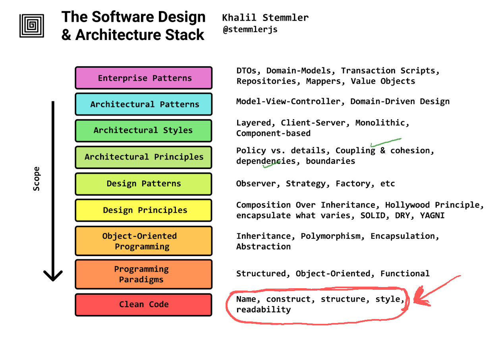
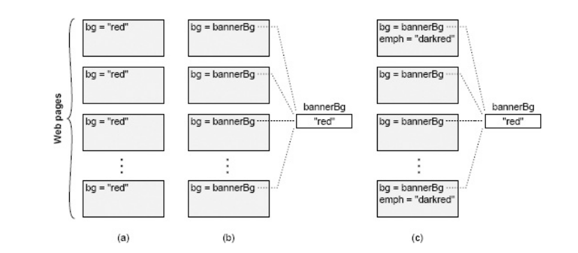
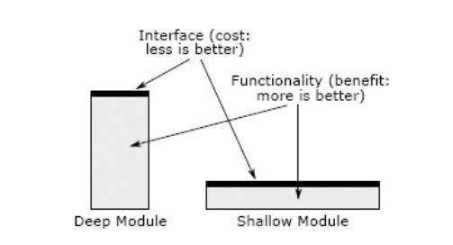

# Lecture 3: Deep modules vs Shallow modules

### Agenda


### What is Complexity?
"Complexity is anything related to the structure of a software system that makes it **hard to understand and modify** the system."

### How to manage complexity
- Make code simple and more obvious
- Modular design: Encapsulate code into small, reusable modules, so that progammers can work on different parts of the system without the need to understand the entire system.

---

### Characteristics of complexity
- **Cost and Benefit:** In a complex system, "it takes a lot of work to implement even small improvements" 
- **Developer Experience:** System size or sophisticated features do not inherently define complexity if the system is easy to work on.
- **Activity-Based Impact:** The overall complexity is *weighted by how frequently developers interact with a particular part of the system.* 
- **Readability Over Writability:** Code that appears simple to its author but complex to others _is_ complex. 

---
## Symptoms of Complexity
**1. Change Amplification:** A simple change necessitates modifications in many different places. 
* **Example:** Changing a banner color in an old website required modifying every page individually, unlike modern sites using a central variable.  
* **Goal of Good Design:** "Reduce the amount of code that is affected by each design decision."
---

**2. Cognitive Load:** The amount of information a developer must know to complete a task. High cognitive load increases learning time and bug risk.  
- **Example:** A C function allocating memory and returning a pointer, requiring the caller to free it, increases cognitive load due to the explicit memory management responsibility.   
 - **Caveat:** Shorter lines of code do not necessarily mean simplicity if cognitive load remains high. "Sometimes an approach that requires more lines of code is actually simpler, because it reduces cognitive load."
---

**3. Unknown Unknowns:** It's unclear which code needs modification or what information is required for a task. This is the "worst" symptom.   
-  **Impact:** Developers "won’t find out about it until bugs appear after you make a change." The only certainty often involves reading "every line of code in the system," which is impractical.  

---



---
## Causes of the complexity
1. **Dependencies:** A piece of code "cannot be understood and modified in isolation" because it relates to other code that must be considered or modified.
2. **Obscurity:** Important information is not obvious.  
	- **Examples:** Generic variable names, undocumented units, hidden dependencies
---
## How to manage complexity?

Modular design is a crucial technique to manage complexity by allowing developers to **"only need to face a small fraction of the overall complexity at any given time."**

**Modular Decomposition:** Systems are broken into relatively independent modules (classes, subsystems, services).

---
###  Interface vs Implementation
* **Interface:** "Everything that a developer working in a different module must know in order to use the given module." It describes _what_ the module does, not _how_. 
- **Implementation:** The code that fulfills the interface's promises. *(The how part)*
---
**Interface Components:** 
-  **Formal:** Explicitly specified in code (e.g., method signatures, public variables) and check-able by the language. 
- **Informal:** High-level behavior, usage constraints, not enforceable by the language, typically described in comments. These are often "larger and more complex than the formal aspects."
---
## Deep vs Shallow modules


---

| Deep modules                                                                  | Shallow modules                                                                                                                                            |
| ----------------------------------------------------------------------------- | ---------------------------------------------------------------------------------------------------------------------------------------------------------- |
| Provide powerful functionality yet have simple interfaces.                    | Interface is relatively complex in comparison to the functionality that it provides.                                                                       |
| If the interface is simple, many internal changes won't affect other modules. | "Don’t provide help much in managing complexity" because the benefit of hiding internal workings is negated by the cost of learning the complex interface. |

---
Unix I/O is a beautiful example of a deep module   
- **Simple interface:**
```
int open(const char* path, int flags, mode_t permissions);
ssize_t read(int fd, void* buffer, size_t count);
ssize_t write(int fd, const void* buffer, size_t count);
off_t lseek(int fd, off_t offset, int referencePosition);
int close(int fd);
```
---

**Implementation (deep)**:  

| Interface (what you learn) | Implementation (what it hides) |
|---|---|
| `open(path, flags, perms)` — "give me a handle to this file" | Walking the directory tree, translating a path string into inodes, checking permissions and ownership, resolving symlinks and mount points, allocating a file descriptor and kernel file-table entry, honoring `O_CREAT`/`O_TRUNC`/`O_APPEND` semantics, and deciding *which* filesystem driver even handles this path (ext4, XFS, NFS, tmpfs, procfs…). |
| `read(fd, buf, count)` — "give me some bytes" | Checking the buffer/page cache first, issuing block requests to the device only on a miss, speculative read-ahead of blocks you haven't asked for yet, disk-head scheduling / SSD flash translation, DMA transfers, blocking the process and context-switching to another until data arrives, and returning short reads at end-of-file or on a pipe. |
| `write(fd, buf, count)` — "store these bytes" | Copying into the page cache and returning *before* the disk is touched (write-back), delayed/coalesced flushing, block allocation and free-space management, journaling so a mid-write crash doesn't corrupt the filesystem, `O_APPEND` atomicity, and enforcing quotas and `ulimit`s. |
| `lseek(fd, offset, whence)` — "move my position" | Maintaining a per-open-file cursor, mapping a logical byte offset to physical block locations that may be fragmented anywhere on the medium, and creating sparse "holes" when you seek past the end and write. |
| `close(fd)` — "I'm done" | Flushing outstanding dirty buffers, releasing the descriptor and kernel structures, decrementing reference counts (the file may still be open elsewhere; blocks may need freeing only when the *last* handle closes), and firing final cleanup for pipes, sockets, or devices. |
| `int fd` — the one value you carry around | A small integer that indexes into a per-process table pointing at a shared kernel file object — which may be backing a disk file, a pipe, a socket, a terminal, or a device, all behind the identical five calls. This is what lets "everything is a file" work. |
| *(the whole interface, collectively)* | Concurrency control so simultaneous readers/writers don't corrupt each other, crash recovery, caching policy, the physical layout of data on the medium, and the entire device-driver layer — none of which appears in a single argument above, and all of which has been rewritten repeatedly without the five signatures ever changing. |

---
Refer [copy example]()

---
Example of a shallow module
```
private void addNullValueForAttribute(String attribute) {
data.put(attribute, null);
}
```

---
> **Red Flag:** Shallow Module
A shallow module is one whose interface is complicated relative to the
functionality it provides. Shallow modules don’t help much in the battle
against complexity, because **the benefit they provide (not having to learn about**
**how they work internally) is negated by the cost of learning and using their**
**interfaces.** Small modules tend to be shallow.
---
## References
1. Chapter 2,4 Philosophy of Software Design
