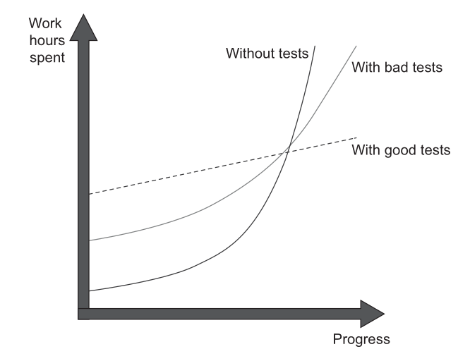
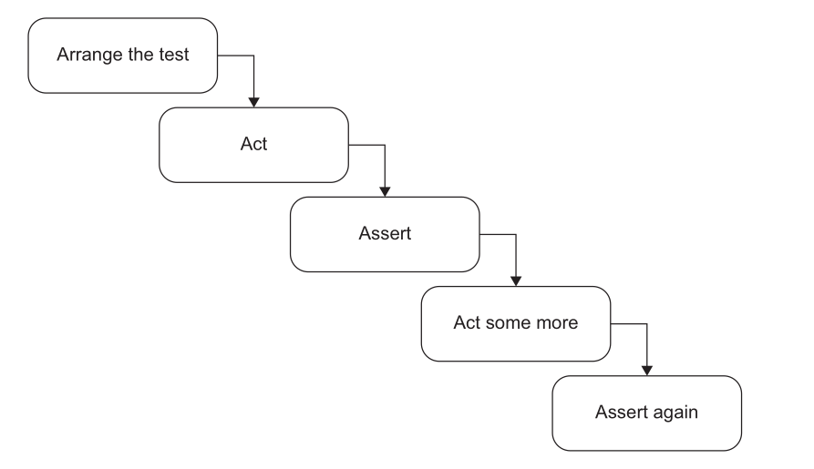

# Unit testing fundamentals & the AAA framework

## The value of self-testing code

### Where does the time actually go?
If you look at how most programmers spend their time, writing code is a small fraction of it. Some time goes into figuring out what ought to happen, some into designing — but **most time goes into debugging**.

- Every programmer has a story about a bug that took a whole day to find.
- **Fixing** the bug is usually quick. **Finding** it is the nightmare.
- And a fix can quietly introduce another bug you won't notice until much later.

---
### Three ways to know your code works

| | **No testing** | **Manual eyeballing** | **Automated self-testing** |
|---|---|---|---|
| How you check | Run the app, click around | Test prints to console, you read it | Test compares against expected, prints `OK` |
| Cost per run | Low effort, low coverage | Boring, slow, error-prone | Nearly free |
| How often you run it | Rarely | Occasionally — it's tedious | Every compile |
| Regression caught | Weeks later, by a user | Whenever you remember to look | Within minutes of writing the bug |
| Where's the bug? | Anywhere in the code base | Somewhere since the last check | In the code you just wrote |

---
> ==Make sure all tests are fully automatic and that they check their own results.==

A test that prints output for a human to inspect is not automated. If a human has to decide pass or fail, it will get skipped.

---
### What automation buys you
Once running tests is as cheap as compiling, you run them on **every** compile:

- A regression shows up **as soon as** you run the test.
- The test passed before → the bug is in the last few minutes of work.
- Small amount of code, still fresh in your mind → easy to find.

**Bugs that would have taken an hour to find now take a couple of minutes.**

---
> ==A suite of tests is a powerful bug detector that decapitates the time it takes to find bugs.==

---
### Tests first
The most useful time to write a test is often **before** writing the code.

- Writing the test asks: *what needs to be done to add this feature?*
- It focuses you on the **interface**, not the implementation.
- It gives you a clear "I'm done" signal — when the test passes.

Kent Beck baked this into **Test-Driven Development (TDD)**: short cycles of *write a failing test → write code to pass it → refactor*. Many cycles per hour.

---
### Why this is hard to sell
- Writing tests means writing a lot of extra code.
- Unless you have *experienced* how it speeds you up, it doesn't seem to make sense.
- Many people were never taught to write tests, or to think about tests at all.
- Manual tests are gut-wrenchingly boring. **Automatic tests can be fun to write.**

---
### Refactoring and testing
> **Refactoring requires tests. If you want to refactor, you have to write tests.**

We spent the last block on complexity, refactoring and code smells. This block builds the safety net that makes all of it possible.

A remarkably small amount of testing work buys surprisingly large benefits.

---

## Unit testing
### What is a unit test?
A unit test is an automated test that  

- Verifies a single unit of behaviour,  
- Does it quickly,  
- and  does it in isolation from other tests.  
---

### Cost vs Benifit
The cost component is determined by the amount of time spent on various activities:

- Refactoring the test when you refactor the underlying code
- Running the test on each code change
- Dealing with false alarms raised by the test
- Spending time reading the test when you’re trying to understand how the
underlying code behaves
---

### Good tests vs bad tests vs no tests




---
### Production code vs test code

> ==Code is a liability, not an asset.== The more code you introduce, the more you extend the surface area for potential bugs in your software, and the higher the project’s upkeep cost. It’s always better to solve problems with as little code as possible. ==Tests are code, too. You should view them as the part of your code base that aims at solving a particular problem: ensuring the application’s correctness.== Unit tests, just like any other code, are also vulnerable to bugs and require maintenance.

---
### Test coverage metric
This metric shows the ratio of the number of code lines executed by at least
one test and the total number of lines in the production code base.

$$\text{code coverage} = \frac{\text{lines executed}}{\text{total lines}}$$

* Coverage metrics are a good negative indicator, but a bad positive one. 
* ==Low coverage numbers—say, below 60%—are a certain sign of trouble.== They mean there's a lot of untested code in your code base. 
* But ==high numbers don't mean anything.==

---
### Counter-example: same behaviour, better number

```cpp
bool IsStringLong(const std::string& input) {   // 1
    if (input.length() > 5)                     // 2
        return true;                            // 3
    return false;                               // 4
}                                               // 5
```

```cpp
TEST(StringUtils, ShortStringIsNotLong) {
    bool result = IsStringLong("abc");
    EXPECT_FALSE(result);
}
```

The test never reaches `return true`. **4 of 5 lines → 80%.**

---
### Now refactor. Don't touch the test.

```cpp
bool IsStringLong(const std::string& input) {   // 1
    return input.length() > 5;                  // 2
}                                               // 3
```

**3 of 3 lines → 100%.**

- Same production behaviour.
- Same test, verifying the same single outcome.
- Coverage rose 80% → 100%.

> ==The number moved. The test suite did not improve.==

---
### Branch coverage

Counts branches traversed instead of lines.

$$\text{branch coverage} = \frac{\text{branches traversed}}{\text{total branches}}$$

- `IsStringLong` has two outcomes: long, not long.
- The test exercises one. **50%** — before *and* after the refactoring.
- Immune to formatting. Still not a measure of quality.

---
### Condition coverage

Branch coverage counts the edges out of a decision. It does not look inside one.

```cpp
bool eligible(bool member, int amount) {
    return member || amount > 1000;
}
```

```cpp
EXPECT_TRUE (eligible(true,  500));
EXPECT_FALSE(eligible(false, 500));
```

Both outcomes of the decision are reached. **Decision coverage: 100%.**

Now delete the second operand and change nothing else:

```cpp
return member;                     // `|| amount > 1000` removed
```

==Both tests still pass.== Half the condition was never tested, and no branch number said so.

- **Condition coverage** — each operand evaluates both `true` and `false`.
- **Condition + branch coverage** — that, *and* both decision outcomes.

The test that catches it is `eligible(false, 1500)`. `gcov -b` reports at operand level rather than decision level, so it does show the gap — see *Reading the C++ report*.

---
### Path coverage

Every route through the function, not every edge.

```cpp
double discount(double amount, bool isMember) {
    if (amount < 0)    return 0;
    if (amount > 1000) return isMember ? 0.2  : 0.1;
    else               return isMember ? 0.05 : 0.0;
}
```

| Path | `amount` | `isMember` | returns |
|---|---|---|---|
| rejected | `-10` | — | `0` |
| large, member | `1500` | `true` | `0.2` |
| large, non-member | `1500` | `false` | `0.1` |
| small, member | `800` | `true` | `0.05` |
| small, non-member | `800` | `false` | `0.0` |

Five paths, five tests. The strongest structural criterion, and the one that stops scaling:

$$\text{paths} = 2^n \quad \text{for } n \text{ independent conditions}$$

Three conditions give 8 paths, ten give 1024, and one loop makes the count unbounded. ==Path coverage is a yardstick, not a target.==

---
### The ladder

| Criterion | Requires | Still blind to |
|---|---|---|
| **Line** | every line executes | which branch was taken |
| **Branch** | every edge out of every decision | operands inside a compound condition |
| **Condition + branch** | every operand both ways, every edge both ways | how the conditions interact |
| **Path** | every route through the function | anything the code never says |

Strength increases down the table. Cost increases faster. Branch is the level worth holding a code base to.

---
### Structural testing

Read a criterion backwards and it stops being a score — it becomes a test list. The five rows above were not measured after the fact. They were derived from the control flow before a single test existed.

That is **structural testing**: test cases taken from the code's own branches and paths.

> ==It can only confirm that the code does what it does.== A branch the author forgot has no edge to cover, so no criterion asks for it.

`discount` at 100% path coverage still says nothing about what should happen at exactly `1000`, or whether a negative amount deserves an error instead of a silent `0`. Those questions come from the specification — Lecture 9-10.

---
### The number you cannot argue with

```cpp
TEST(StringUtils, CoversEverything) {
    IsStringLong("abc");
    IsStringLong("abcdef");
}
```

- 100% line coverage.
- 100% branch coverage.
- **Zero assertions.** Nothing is verified.

Coverage records which production code *ran*. It says nothing about which outcomes were *checked*.

A real guard against exactly this: [`test_the_catalogue_is_actually_being_parsed`](https://github.com/Piyushtanwani/DAU-buddy/blob/b909c221fcccb069f3ff9eb40e8292b435145d8a/tests/test_prompt_tool_catalogue.py#L32-L34) exists only to prove the *other* test in its file is not quietly asserting over an empty set.

---
### Why a coverage target backfires

- Coverage rises when you delete lines, not only when you test them.
- It ignores paths inside the libraries you call.
- ==Mandate a number and people write tests that hit lines without asserting anything.==

Use coverage to find untested areas. Never as a pass/fail gate.

---
### Measuring it: C++ with GoogleTest

Instrument the build. In `CMakeLists.txt`:

```cmake
set(CMAKE_CXX_FLAGS "${CMAKE_CXX_FLAGS} -fprofile-arcs -ftest-coverage -O0 -g")
target_link_libraries(runTests ${GTEST_LIBRARIES} gtest_main pthread gcov)
```

Install the report generator, once:

```bash
sudo apt install gcovr      # or: pip install gcovr
```

Build, run, report:

```bash
cmake -S. -B build
cmake --build build
./build/runTests            # running the tests writes the .gcda data
gcovr -r . --exclude '.*tests/.*'
```

---
### Reading the C++ report

```
File              Lines    Exec  Cover   Missing
src/game.cpp          6       6   100%
TOTAL                 6       6   100%
```

Branch coverage instead of lines:

```bash
gcovr -r . --exclude '.*tests/.*' --txt-metric branch
```

Line-by-line HTML, red for missed:

```bash
gcovr -r . --exclude '.*tests/.*' --html-details -o coverage.html
```

> ==Always exclude your test directory.== Otherwise your test code is counted as covered production code and inflates the number.

---
### Measuring it: Python with pytest

```bash
pip install pytest-cov
```

```bash
pytest --cov=api --cov-report=term-missing   # which lines are missed
pytest --cov=api --cov-branch                # branch coverage
pytest --cov=api --cov-report=html           # htmlcov/index.html
```

`--cov` takes the package to measure, not the test directory.

---
### A real code base

`dau-mcp-server`: 173 tests, 3.9 s, 3848 statements.

| Metric | Value |
|---|---|
| Line coverage | **37%** |
| Branch coverage | **33%** |

| File | Cover | |
|---|---|---|
| `name_matching.py` | 96% | someone tested this behaviour |
| `library_service.py` | 88% | |
| `timetable_service.py` | 35% | only faculty resolution is tested |
| `fallback.py` | 4% | 232 statements, 222 untested |
| `context_builder.py` | 0% | |

- 37% is below Khorikov's 60% line. The suite is honestly incomplete.
- Adding `--cov-branch` *lowers* the number. Stricter question, same tests.
- `name_matching.py` is not good because it scores 96%. It scores 96% because it was tested.
- ==The 4% and the 0% are the useful output. That is the negative indicator doing its job.==

And a covered line is not a checked one: [`test_retrieve_respects_limit`](https://github.com/Piyushtanwani/DAU-buddy/blob/b909c221fcccb069f3ff9eb40e8292b435145d8a/tests/test_retrieval.py#L39-L43) carries the comment `# Assuming there are at least 3 faculties in DB`, then asserts `len(results) <= 2`. It passes on an empty database.

---
### What makes a successful test suite?
A successful test suite has the following properties:  

* It's integrated into the development cycle.    
* It targets only the most important parts of your code base.  
* It provides maximum value with minimum maintenance costs.  

---

## Anatomy of a unit test
---
### Arrange-Act-Assert
Each test is divided into three distinct sections:

• **Arrange:** This section is responsible for bringing the System Under Test (SUT) and all its dependencies into the desired state required for the test.  
• **Act:** In this section, a method is called on the SUT to trigger the specific behavior being tested. The output or result of this action is captured.   
• **Assert:** This final section verifies that the outcome of the `Act` section matches expectations. This can involve checking a return value, the final state of the SUT or its collaborators, or methods called on those collaborators.  

---
Example:

```c++
TEST(SnakeBehaviour, NextHeadLeft) {

// arrange
pair<int, int> current = make_pair(rand() % 10, rand() % 10);
// act
pair<int, int> next_head = get_next_head(current, 'l');
// assert
EXPECT_EQ(next_head,make_pair(current.first,current.second-1));
}
```

---
### AAA in the wild

Python, but the shape is the point.

**[`test_every_advertised_tool_is_callable`](https://github.com/Piyushtanwani/DAU-buddy/blob/b909c221fcccb069f3ff9eb40e8292b435145d8a/tests/test_prompt_tool_catalogue.py#L37-L44)**

- **Arrange:** nothing to set up.
- **Act:** one line — the set of tools the prompt advertises, minus the set actually registered.
- **Assert:** `assert not unreachable`, carrying a message that names the offenders *and* the two files to fix.

No `# arrange` / `# act` comments. The structure is visible without them.

The [module docstring](https://github.com/Piyushtanwani/DAU-buddy/blob/b909c221fcccb069f3ff9eb40e8292b435145d8a/tests/test_prompt_tool_catalogue.py#L1-L13) records why the test exists: `check_room_availability` was advertised to the model for months without existing, because two surfaces had no test tying them together.

> ==A test is an executable bug report.==

---

### Anti-Patterns to Avoid


#### Multiple AAA Sections:** 

  

- Such a test is no longer a unit test but an integration test. It should be refactored by extracting each `Act` into its own distinct test.
- **Exception:** This structure is sometimes acceptable as an optimization for slow integration tests where system states naturally flow from one to the next. It is not appropriate for unit tests.

Looks like it, but isn't: [`test_ip_backstop_limit`](https://github.com/Piyushtanwani/DAU-buddy/blob/b909c221fcccb069f3ff9eb40e8292b435145d8a/tests/test_chat_guardrails.py#L208-L215) — a loop of 60 requests, each asserted, then a 61st expecting `429`.

- The loop is **Arrange**. Sixty requests to reach the boundary. The Act is the 61st.
- One behaviour under test, one assert on it. The in-loop assert guards the setup: if the endpoint stopped returning `401`, the `429` would mean nothing.
- ==Ask which section a statement belongs to, not how many asserts you can count.==

---

#### if statements 
Tests should be a simple, linear sequence of steps with no branching. ==An `if` statement indicates the test is verifying too many things at once and must be split into multiple, more focused tests.== This rule applies to both unit and integration tests, ==as branching provides no benefits and only increases maintenance costs.==

---
#### Three of them in one code base

| Test | What goes wrong |
|---|---|
| [`test_retrieve_faculty_basic`](https://github.com/Piyushtanwani/DAU-buddy/blob/b909c221fcccb069f3ff9eb40e8292b435145d8a/tests/test_retrieval.py#L14-L21) | `if results:` — an empty database makes it assert only `isinstance(results, list)`. Passes while verifying nothing. |
| [`test_venue_overlap_logic`](https://github.com/Piyushtanwani/DAU-buddy/blob/b909c221fcccb069f3ff9eb40e8292b435145d8a/tests/test_timetable_mcp_availability.py#L110-L119) | Branches on the *expected value*. Right instinct, wrong shape. |
| [`test_get_book_details_live`](https://github.com/Piyushtanwani/DAU-buddy/blob/b909c221fcccb069f3ff9eb40e8292b435145d8a/tests/test_library.py#L362-L375) | `pytest.skip()` on a data condition, halfway through. Green without testing the behaviour. |

---
#### Removing the branch

The parametrized cases are worth keeping. Only the `if` has to go.

```python
# antipattern
if expected_available:
    assert "CEP-102" in available_venues
else:
    assert "CEP-102" not in available_venues

# linear
assert ("CEP-102" in available_venues) == expected_available
```

---
### How large each section should be?
- ARRANGE section is usually the largest.
- ACT section is usually single line
	- More than single line is a smell. Shows lack of encapsulation
	- When a single business operation requires multiple method calls from the client, it creates the risk of **invariant violations** (e.g., a customer acquires a product, but the inventory is not reduced).
	
---

Bad example: 
```c#
[Fact]
public void Purchase_succeeds_when_enough_inventory()
{
// Arrange
var store = new Store();
store.AddInventory(Product.Shampoo, 10);
var customer = new Customer();
// Act
bool success = customer.Purchase(store, Product.Shampoo, 5);
store.RemoveInventory(success, Product.Shampoo, 5);
// Assert
Assert.True(success);
Assert.Equal(5, store.GetInventory(Product.Shampoo));
}
```
Good example:

```c#
[Fact]
public void Purchase_succeeds_when_enough_inventory()
{
// Arrange
var store = new Store();
store.AddInventory(Product.Shampoo, 10);
var customer = new Customer();
// Act
bool success = customer.Purchase(store, Product.Shampoo, 5);
// Assert
Assert.True(success);
Assert.Equal(5, store.GetInventory(Product.Shampoo));
}
```

---
### How many assertions in a test?
A unit in unit testing is a unit of behavior, not a unit of code. A single unit of behavior can exhibit multiple outcomes, and ==it’s fine to evaluate them all in one test==.

[`test_retrieve_empty_query`](https://github.com/Piyushtanwani/DAU-buddy/blob/b909c221fcccb069f3ff9eb40e8292b435145d8a/tests/test_retrieval.py#L32-L37) — four asserts, one behaviour: a blank query returns an empty list, for faculty and staff alike.

---
### Naming a unit test

A name is read far more often than the test body. On failure, the name *is* the report.

Bad — a rigid template:

```
Sum_TwoNumbers_ReturnsSum
IsDeliveryValid_InvalidDate_ReturnsFalse
```

- Legible only to someone who already knows the code.
- Binds the test name to a *method* name. Rename the method and the name lies.
- You test **behaviour**, not methods.

---
### The rule

> ==Name the test as if describing the scenario to a non-programmer who knows the problem domain.==

1. No rigid naming policy. Complex behaviour needs a complex description.
2. Separate words with underscores.
3. Keep the SUT's method name out of the test name.

---
### Working a name into shape

| Step | Name |
|---|---|
| Template | `IsDeliveryValid_InvalidDate_ReturnsFalse` |
| Plain English | `Delivery_with_invalid_date_should_be_considered_invalid` |
| Drop "should be" | `Delivery_with_invalid_date_is_considered_invalid` |
| Name the real rule, not "invalid" | `Delivery_with_past_date_is_invalid` |

"Should be" hedges. A test states a fact about the system.

---
### From a real code base

```
test_exact_match_wins_over_longer_substring_match
test_venue_with_no_sessions_still_reports_the_substitution
test_an_explicit_day_needs_no_calendar_at_all
```

Each name asserts a fact. When one turns red, the report names the broken behaviour before you open the file.

[Two more, in full](https://github.com/Piyushtanwani/DAU-buddy/blob/b909c221fcccb069f3ff9eb40e8292b435145d8a/tests/test_prompt_tool_catalogue.py#L32-L44). Neither contains the name of the function under test, `list_tools`.

Compare: `test_resolve_faculty_2`.

---

## References
1. [Chapters 1 & 3, Unit Testing, Principles Practices and Patterns by Vladimir Khorikov](https://www.manning.com/books/unit-testing)
2. [Chapter 4, Building Tests, Refactoring (2nd ed.) by Martin Fowler](https://martinfowler.com/books/refactoring.html)
3. Worked examples from [DAU-buddy](https://github.com/Piyushtanwani/DAU-buddy), pinned at commit [`b909c22`](https://github.com/Piyushtanwani/DAU-buddy/tree/b909c221fcccb069f3ff9eb40e8292b435145d8a).
