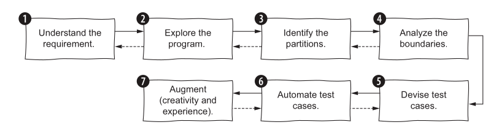
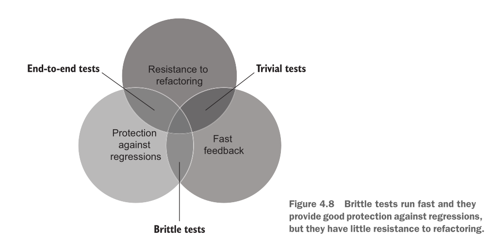

# Choosing what to test, and what makes a test good

## Quick recap
Last block you learned to write *one* good test:   

- Arrange-Act-Assert,   
- one Act,   
- no branching,  
- a name that states a fact.   
- Coverage tells you what you missed, never what you proved.  

## Lecture 9-10

### Agenda
Two questions remain:

1. **Which** tests should exist? 
2. How do you tell a **good** suite from a bad one? 

---
### Where do test cases come from?

Only two places.

| Source | Called | You look at |
|---|---|---|
| What the code **should** do | Specification testing | the requirements |
| What the code **does** do | Structural testing | the implementation |

- Derive from the code and you inherit its bugs. A test written from a buggy
  implementation asserts the bug.
- Derive from the spec and you can catch code that is confidently wrong.

> ==An LLM writes tests from your code. You are the only one who has the specification.==

---
### Four ways to derive test cases

1. **Specification tests** — from what it *should* do, not how it is written.
2. **Boundary tests** — just below, at, and just above every limit.
3. **Property-based tests** — state a property, let the framework generate hundreds of inputs.
4. **Structural tests** — from the code's own paths and branches.


---
### Specification-based testing



---
#### The specification

> `gradeFromMarks(int marks)` returns a grade based on:
>
> - 90–100 → `"A"`
> - 75–89 → `"B"`
> - 50–74 → `"C"`
> - below 50 → `"F"`

Read it before you read any code. Write down what it promises.

---
#### Step 1: partition the input

Every input value falls into exactly one class where behaviour is uniform.

| Partition | Expected |
|---|---|
| `marks < 50` | `"F"` |
| `50 ≤ marks ≤ 74` | `"C"` |
| `75 ≤ marks ≤ 89` | `"B"` |
| `90 ≤ marks ≤ 100` | `"A"` |
| `marks < 0` | **the spec does not say** |
| `marks > 100` | **the spec does not say** |

One test per partition. Pick the simplest value in each — `60`, not `61.5`.

---
#### Step 2: the partitions the spec forgot

The last two rows are the point of the exercise.

```cpp
std::string gradeFromMarks(int marks) {
    if (marks >= 90) return "A";
    else if (marks >= 75) return "B";
    else if (marks >= 50) return "C";
    else return "F";
}
```

```cpp
TEST(GradeSpec, MarksAboveHundredAreNotSpecified) {
    EXPECT_EQ(gradeFromMarks(150), "A");   // passes
}
```

- The spec says A means 90–100. The code awards A for 150, and for 10000.
- Nothing in the code is *wrong*. The **specification is incomplete**.

> ==Specification testing finds holes in the specification. Structural testing never can — the code has no hole, only a behaviour.==

Generate this function from that spec with any model and you get this exact code.
Ask the model to write tests for the code and every one of them passes.

---
#### Step 3: the seven-step loop

1. **Understand the requirements** — inputs, outputs, types, domains.
2. **Explore the program** — try inputs, build a mental model.
3. **Identify partitions** — of every input, and of the output.
4. **Find boundaries** — where partitions meet.
5. **Design cases** — combine partitions; test exceptional cases once.
6. **Automate** — clear inputs, explicit expected values.
7. **Refine** — reread for gaps.

It is a **loop, not a checklist**. Writing step 6 sends you back to step 3.

---
#### What matters in practice

- **Depth follows risk.** Test the fee calculation harder than the tooltip.
- **Partition or boundary — don't argue.** What matters is that the case exists.
- **Vary one seed input.** Start from `"abc"` and tweak it; debugging stays easy.
- **Keep inputs boring.** Small integers, short strings, unless complexity is the point.
- **Test null only where null can occur.** A UI boundary, not an internal helper.
- **Split the method** when the combinations explode. Untestable usually means too big.

---
#### Partitions in a real code base

[`test_parse_day_substitution`](https://github.com/Piyushtanwani/DAU-buddy/blob/b909c221fcccb069f3ff9eb40e8292b435145d8a/tests/test_calendar.py#L118-L127)

The academic calendar reassigns dates — *"07-08-2026 to be treated as Tuesday"*.
The parser must recognise those and ignore everything else.

| Case | Partition |
|---|---|
| `"To be treated as Tuesday"` | canonical form |
| `"To be Treated as Friday"` | capitalisation varies in the real data |
| `"to be treated as    wednesday"` | whitespace varies too |
| `"Orientation of Fresh BTech Students"` | a real event, not a substitution |
| `"Instruction begins"` | ditto |
| `""` | empty |

Six cases, three partitions: parses, does not parse, degenerate. The three
formatting variants are one partition — they exist because the *data* is
inconsistent, and that is a domain fact no amount of reading the code reveals.

---
### Boundary testing

==Bugs cluster where partitions meet.== `>=` written as `>`, a loop that stops one
short, a cutoff that belongs to the wrong side.

For a condition like `marks >= 90`:

- **on-point** — the value in the condition: `90`
- **off-point** — the nearest value that flips it: `89`

> ==On-point: the number you can point to in the condition. Off-point: its
> neighbour on the other side.==

The boundary lies *between* them — "on" means on the condition, not on the
number line. The on-point need not satisfy the condition: `marks > 89` has
on-point `89`, which fails it.

Test both. One of them is where the bug lives.

---
#### Every boundary in `gradeFromMarks`

| Boundary | off | on |
|---|---|---|
| F / C | `49` | `50` |
| C / B | `74` | `75` |
| B / A | `89` | `90` |
| top of range | `100` | `101` — unspecified |

Seven values pin every cutoff. You do not need `63`, `81`, and `95` as well.

---
#### `>` or `>=`? The on-point moves

Two spellings of one cutoff, identical for every `int`:

```cpp
if (marks >= 90) return "A";     // on-point 90, off-point 89
if (marks >  89) return "A";     // on-point 89, off-point 90
```

| Condition | on-point | satisfies it? | returns |
|---|---|---|---|
| `marks >= 90` | `90` | yes | `"A"` |
| `marks > 89` | `89` | **no** | `"B"` |

Same function, same two values tested — only the label moves.

==The on-point is the number the author typed.== Testing it asks whether the
cutoff they wrote is the cutoff they meant.

---
#### The bug this catches

The spec says 90–100 → A. The author types `marks > 90`.

| Test value | expected | typo returns | verdict |
|---|---|---|---|
| `90` — on-point | `"A"` | `"B"` | **caught** |
| `89` — off-point | `"B"` | `"B"` | agrees |

==Read the on-point off the source. Here it is the only value that catches the
typo.==

---
#### Boundaries in a real code base

[`test_venue_overlap_logic`](https://github.com/Piyushtanwani/DAU-buddy/blob/b909c221fcccb069f3ff9eb40e8292b435145d8a/tests/test_timetable_mcp_availability.py#L77-L88)

"Is this room free from 14:00 to 16:00?" is an interval-overlap question, and
interval overlap is *all* boundary:

| Requested | Occupied | Free? | Why it is on the list |
|---|---|---|---|
| 14–16 | 15–16 | no | partial overlap |
| 14–16 | 12–14 | **yes** | touches at the start — off-point |
| 14–16 | 16–18 | **yes** | touches at the end — off-point |
| 14–18 | 15–16 | no | occupied sits inside |
| 15–16 | 14–18 | no | occupied surrounds |

The two `yes` rows are the whole test. Get `<` and `<=` backwards and a room
booked 12:00–14:00 blocks the 14:00 lecture.

---

#### Writing them without duplication

Seven near-identical `TEST()` blocks is copy-paste. GoogleTest has parameterized
tests for exactly this shape.

Three pieces:

1. A class inheriting `::testing::TestWithParam<T>` — `T` is your row type.
2. `TEST_P(...)`, reading the row with `GetParam()`.
3. `INSTANTIATE_TEST_SUITE_P(...)` supplying the rows.

---

#### The whole thing

```cpp
#include <gtest/gtest.h>
#include <string>
#include <tuple>

class GradeCutoff : public ::testing::TestWithParam<std::tuple<int, std::string>> {};

TEST_P(GradeCutoff, ReturnsTheGradeTheSpecPromises) {
    auto [marks, expected] = GetParam();       // C++17 structured binding
    EXPECT_EQ(gradeFromMarks(marks), expected);
}

INSTANTIATE_TEST_SUITE_P(OnAndOffPoints, GradeCutoff, ::testing::Values(
    std::make_tuple(49,  "F"), std::make_tuple(50,  "C"),
    std::make_tuple(74,  "C"), std::make_tuple(75,  "B"),
    std::make_tuple(89,  "B"), std::make_tuple(90,  "A"),
    std::make_tuple(100, "A")
));
```

Seven tests from one body. Adding a boundary is adding a line.

```
[  PASSED  ] 7 tests.
```

---

#### Why the table beats seven functions

- A failure reports `OnAndOffPoints/GradeCutoff.ReturnsTheGradeTheSpecPromises/4` —
  row 4, and the row is right there.
- The table **is** the partition analysis. Reviewers read your reasoning, not your loops.
- Recall the antipattern: a parameterized test must stay linear. Never branch on
  the expected value — put the expectation in the table.

---

#### Exercise

1. Implement [add-strings](https://leetcode.com/problems/add-strings) — add two
   non-negative integers given as strings, without converting them to integers.
2. Before writing any code, write the partition table. Include what the spec
   does not say.
3. Turn the boundaries into one `INSTANTIATE_TEST_SUITE_P`.

Bring the table. That is what gets marked, not the implementation.

---
#### Exercise: the answer

Work each question before you open the hint. The reasoning is the deliverable.

---
!!! question "💬 Q1. What are the partitions?"

    Two strings in. There is no numeric range to slice. So what actually varies?

    ??? hint "Answer"
        Behaviour is uniform inside each of these. One test per row:

        | Partition | Example | Expected |
        |---|---|---|
        | No carry anywhere | `"12" + "34"` | `"46"` |
        | Carry inside the number | `"18" + "14"` | `"32"` |
        | Carry out of the leading digit | `"45" + "55"` | `"100"` |
        | Carry propagates the whole way | `"999" + "1"` | `"1000"` |
        | `num1` longer | `"1000" + "1"` | `"1001"` |
        | `num2` longer | `"1" + "1000"` | `"1001"` |
        | One operand `"0"` | `"0" + "5"` | `"5"` |
        | Both operands `"0"` | `"0" + "0"` | `"0"` |

        Now partition the **output**, as step 3 asks. The sum of two `n`-digit
        numbers has exactly `n` or `n+1` digits — two classes, and the second is
        where implementations break.

---
!!! question "💬 Q2. Which partitions does the spec forget?"

    The constraints promise: digits only, no leading zeros, length 1 to 10⁴,
    non-negative. Every one of those is a promise about the **input**. What has
    nobody promised?

    ??? hint "Answer"
        **The output format.** The problem forbids leading zeros in `num1` and
        `num2`, and says nothing at all about the string you return.

        This implementation writes one column per digit, then appends the carry:

        ```cpp
        for (int k = 0; k < n; ++k) { /* ...one column... */ }
        out += char('0' + carry);          // always, even when carry == 0
        std::reverse(out.begin(), out.end());
        ```

        `addStrings("1", "1")` returns `"02"`. `addStrings("0", "0")` returns
        `"00"`. Read the statement line by line: nothing is violated.

        > ==Same shape as `gradeFromMarks(150)`. The code is not wrong. The
        > specification is incomplete.==

        The constraints also **exclude** inputs instead of defining them —
        `"007" + "1"`, `"" + "5"`, `"12a" + "1"`, `"-5" + "1"`. Your function
        still accepts all four. `"007" + "1"` returns `"008"`; is that right?
        Deciding is the missing half of the spec.

---
!!! question "💬 Q3. Where are the boundaries?"

    On and off points are defined against a **condition**. This specification
    states none. So where are they?

    ??? hint "Answer"
        Not in the input range — in the **carry**. The condition is absent from
        the spec but present in every correct implementation:

        ```cpp
        carry = (columnSum >= 10);
        ```

        Write it down and the rule from earlier applies:

        | Boundary | off | on |
        |---|---|---|
        | column carries | `"4" + "5"` → `"9"`, sum is `9` | `"5" + "5"` → `"10"`, sum is `10` |
        | leading column carries out | `"45" + "54"` → `"99"`, 2 digits | `"45" + "55"` → `"100"`, 3 digits |

        Length has boundaries too: `1` and `10⁴`. The lower one is a real test.
        The upper one tells you 10⁴ digits fit in no integer type — which is the
        whole reason the problem exists.

        > ==The spec never mentions carrying. This boundary came from knowing
        > decimal addition — step 1, "understand the requirements", includes the
        > domain.==

---
!!! question "💬 Q4. What does the table look like?"

    Ten rows, one `INSTANTIATE_TEST_SUITE_P`, no branching.

    ??? hint "Answer"
        ```cpp
        class AddStrings : public ::testing::TestWithParam<
                std::tuple<std::string, std::string, std::string>> {};

        TEST_P(AddStrings, ReturnsTheSumTheSpecPromises) {
            auto [num1, num2, expected] = GetParam();
            EXPECT_EQ(addStrings(num1, num2), expected);
        }

        INSTANTIATE_TEST_SUITE_P(PartitionsAndBoundaries, AddStrings, ::testing::Values(
            std::make_tuple("12",   "34",   "46"),     // no carry
            std::make_tuple("4",    "5",    "9"),      // sum 9  — off point of `>= 10`
            std::make_tuple("5",    "5",    "10"),     // sum 10 — on point of `>= 10`
            std::make_tuple("45",   "54",   "99"),     // leading column — off point
            std::make_tuple("45",   "55",   "100"),    // leading column — on point, result grows
            std::make_tuple("999",  "1",    "1000"),   // carry all the way
            std::make_tuple("1000", "1",    "1001"),   // num1 longer
            std::make_tuple("1",    "1000", "1001"),   // num2 longer
            std::make_tuple("0",    "5",    "5"),      // identity
            std::make_tuple("0",    "0",    "0")       // both zero
        ));
        ```

        - Against the padded implementation from Q2, **seven rows fail and three
          pass**. Rows 3, 5 and 6 are the ones that carry out, so the extra digit
          is the real one and the bug hides. A suite can hold both the case that
          catches a bug and the case that conceals it.
        - Rows 7 and 8 are one partition seen from each side. Keep both —
          handling only the longer operand is the next most common bug here.
        - Row 10 is the only test that pins `"0" + "0" == "0"` rather than `"00"`.


---
### Four attributes

Every automated test — unit, integration or end-to-end — can be scored on four:

- **Protection against regressions**
- **Resistance to refactoring**
- **Fast feedback**
- **Maintainability**

They are not independent. That is the whole problem.

---
#### Protection against regressions

A regression is a feature that stops working after a change.

This attribute measures how likely the test is to **notice**. It grows with:

- the *amount* of code the test executes,
- the *complexity* of that code,
- the code's *domain significance*.

A test over your payment logic protects more than a test over a getter — even
though both are one test.

---
#### Resistance to refactoring

Refactoring changes code **without changing observable behaviour**.

Resistance to refactoring is how much restructuring a test survives **without
raising a false alarm**.

- A test that fails when you rename a private method is not protecting you.
- It is reporting that the code changed. You knew that.

---
#### The two ways a test can lie

| | Functionality correct | Functionality broken |
|---|---|---|
| **Test passes** | ✅ | ❌ **false negative** — missed bug |
| **Test fails** | ❌ **false positive** — false alarm | ✅ |

- Protection against regressions attacks the **top-right**.
- Resistance to refactoring attacks the **bottom-left**.

Everyone worries about missed bugs. False alarms are what actually kill a suite.

---
#### What causes a false positive?

> ==The more a test is coupled to implementation details of the system under
> test, the more false alarms it raises.==

The only fix is to decouple: assert on **observable behaviour**, not on how the
result was reached.

Test what the function returns. Not which private helper it called on the way.

---
#### Why false alarms are the worse failure

- They dilute your willingness to react. You get used to red and stop reading it.
- They destroy trust in the suite as a safety net.

A suite nobody trusts is deleted, or — worse — ignored while still running.

---
#### Fast feedback

How quickly the test runs.

- Slow tests get run less often.
- Tests run less often catch regressions later.
- Later means a bigger diff to search.

This is Fowler's argument from the opening of this block, restated as a measurable
property. Your 173-test suite in 1.7 seconds is run every save. A 20-minute suite
is run at 5pm.

---
#### Maintainability

Two components:

- **How hard the test is to understand.** Smaller is more readable.
- **How hard the test is to run.** Fewer out-of-process dependencies — no
  database, no network, no clock — means fewer things to keep alive.

The recap example: [`test_parse_day_substitution`](https://github.com/Piyushtanwani/DAU-buddy/blob/b909c221fcccb069f3ff9eb40e8292b435145d8a/tests/test_calendar.py#L118-L127)
is a table and a one-line assert. Nothing to keep running.

---
#### The trade-off



You cannot maximise all four.

- An end-to-end test scores high on regression protection and refactoring
  resistance, and terribly on speed.
- A trivial unit test is fast and maintainable and protects nothing.

==Resistance to refactoring is the one attribute you cannot trade away.== A test
is either coupled to implementation details or it isn't; there is no useful
middle. Pick your position on the other three.

---
#### What this is worth when a machine writes the code

- An agent refactors freely. A suite full of false positives goes red on every
  run, you learn to ignore it, and you merge a diff nobody read.
- An agent cannot tell a false alarm from a real regression. It will "fix" your
  production code to satisfy a test asserting an implementation detail.
- Regression protection is what lets you accept a change you did not write.

> ==A codebase with good tests is an agent's superpower. A codebase without them
> is a liability.==

---
#### Scoring a test you have already seen

[`test_venue_overlap_logic`](https://github.com/Piyushtanwani/DAU-buddy/blob/b909c221fcccb069f3ff9eb40e8292b435145d8a/tests/test_timetable_mcp_availability.py#L77-L88)

| Attribute | Score | Why |
|---|---|---|
| Protection | high | interval logic, real domain significance |
| Refactoring resistance | high | asserts the answer, not how it was computed |
| Fast feedback | medium | writes to a real SQLite database |
| Maintainability | medium | needs rows inserted before it can ask anything |

Fixing the middle two is the subject of the next block: **test doubles**.

---

## References
1. [Chapter 4, Unit Testing, Principles Practices and Patterns by Vladimir Khorikov](https://www.manning.com/books/unit-testing)
2. Chapters 2–3, *Effective Software Testing* by Maurício Aniche — specification and boundary testing
3. [Parameterized tests, GoogleTest documentation](http://google.github.io/googletest/advanced.html#value-parameterized-tests)
4. Worked examples from [DAU-buddy](https://github.com/Piyushtanwani/DAU-buddy), pinned at commit [`b909c22`](https://github.com/Piyushtanwani/DAU-buddy/tree/b909c221fcccb069f3ff9eb40e8292b435145d8a).
