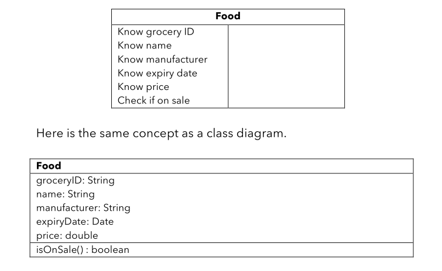

---
delivery date:
  - "[[2025-07-28]]"
---
#### Quick recap
- Programming paradigms
	prodecural => modular => Object oriented => Generic programming

---
#### Agenda
- Design principles
	- Abstraction
	- Encapsulation
	- Decomposition
	- Generalization

---
#### Abstraction
- Helps in **modeling real-world concepts** in problem domain
- Simplifies complexity by **focusing on essential details**
- **Ignores irrelevant** information
---
##### How it"s implemented?
- **Attributes**: Do not disappear over time
- **Behaviours**: Actions/responsibilities of the concept
---
#####  UML representation

---
#### Encapsulation
- **Bundle** data + behaviour
- **Expose** limited functionality via interface
- **Restrict** access to internal details
---
##### How it"s implemented
- Bundle (implicitly via usage of classes)
- Restricted access (use of private/public access classifiers)
- Expose (via setters and getters)
---
##### UML representation

---
##### Advantages
- Internal implementation hidden (black box)
- Only interface matters
- Enables modular and maintainable code
- Getters: Retrieve private data
- Setters: Safely update private data
---
#### Decomposition
- Break down complex system into parts
- Also combine parts to build wholes
- Makes systems easier to understand and manage
---
**Whole-Part Design**
- Each part has specific responsibility
- Class per part; main object coordinates parts 
**Nature of Parts:**
- **Fixed**: Oven has 4 burners
- **Dynamic**: Fridge holds varying food items
- **Recursive**: Kitchen → Oven → Burner
---
**Lifetimes**:
- Parts may have dependent or independent lifetimes
- e.g., Gauge failure disables fridge vs. spoiled food doesn’t
---
#### UML representation
- **Association**: Loose connection  
Eg: Person <-> hotel
- **Aggregation**: Whole–part, loosely bound
Eg: Airliner "has-a" Crew
- **Composition**: Whole–part, tightly bound
Eg: House "has-a" room

---
#### Generalization
- Remove redundancy
- Capture shared traits in a superclass
- Subclasses extend and specialize
- DRY(Dont Repeart yourself) principle
- YAGNI (You are going to need it once)
---
##### UML representation
- Arrow from subclass → superclass
- Superclass on top
- Subclass only declares new attributes/behaviours
---
