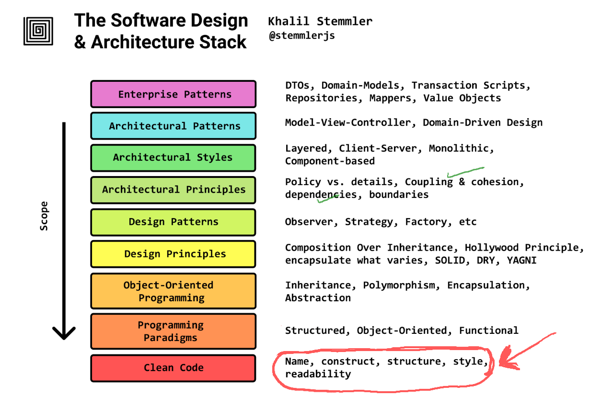
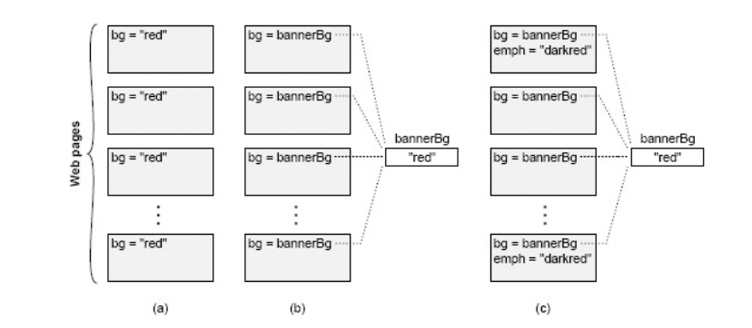

---
delivery date:
  - "[[2025-08-25]]"
---
## Agenda


---
### What is Complexity?
"Complexity is anything related to the structure of a software system that makes it **hard to understand and modify** the system."

---
### Characteristics of complexity
- **Cost and Benefit:** In a complex system, "it takes a lot of work to implement even small improvements" 
- **Developer Experience:** System size or sophisticated features do not inherently define complexity if the system is easy to work on.
- **Activity-Based Impact:** The overall complexity is *weighted by how frequently developers interact with a particular part of the system.* 
- **Readability Over Writability:** Code that appears simple to its author but complex to others _is_ complex. 

---
## Symptoms of Complexity
**1. Change Amplification:** A simple change necessitates modifications in many different places. 
* **Example:** Changing a banner color in an old website required modifying every page individually, unlike modern sites using a central variable.  
* **Goal of Good Design:** "Reduce the amount of code that is affected by each design decision."
---

**2. Cognitive Load:** The amount of information a developer must know to complete a task. High cognitive load increases learning time and bug risk.  
- **Example:** A C function allocating memory and returning a pointer, requiring the caller to free it, increases cognitive load due to the explicit memory management responsibility. 
 - **Caveat:** Shorter lines of code do not necessarily mean simplicity if cognitive load remains high. "Sometimes an approach that requires more lines of code is actually simpler, because it reduces cognitive load."
---

**3. Unknown Unknowns:** It's unclear which code needs modification or what information is required for a task. This is the "worst" symptom. 
-  **Impact:** Developers "won’t find out about it until bugs appear after you make a change." The only certainty often involves reading "every line of code in the system," which is impractical.  

---



---
## Causes of the complexity
1. **Dependencies:** A piece of code "cannot be understood and modified in isolation" because it relates to other code that must be considered or modified.
2. **Obscurity:** Important information is not obvious.  
	- **Examples:** Generic variable names, undocumented units, hidden dependencies
---
## How to manage complexity?

Modular design is a crucial technique to manage complexity by allowing developers to **"only need to face a small fraction of the overall complexity at any given time."**

**Modular Decomposition:** Systems are broken into relatively independent modules (classes, subsystems, services).

---
###  Interface vs Implementation
* **Interface:** "Everything that a developer working in a different module must know in order to use the given module." It describes _what_ the module does, not _how_. 
- **Implementation:** The code that fulfills the interface's promises. *(The how part)*
---
**Interface Components:** 
-  **Formal:** Explicitly specified in code (e.g., method signatures, public variables) and check-able by the language. 
- **Informal:** High-level behavior, usage constraints, not enforceable by the language, typically described in comments. These are often "larger and more complex than the formal aspects."
---
## Deep vs Shallow modules


---

| Deep modules                                                                  | Shallow modules                                                                                                                                            |
| ----------------------------------------------------------------------------- | ---------------------------------------------------------------------------------------------------------------------------------------------------------- |
| Provide powerful functionality yet have simple interfaces.                    | Interface is relatively complex in comparison to the functionality that it provides.                                                                       |
| If the interface is simple, many internal changes won't affect other modules. | "Don’t provide help much in managing complexity" because the benefit of hiding internal workings is negated by the cost of learning the complex interface. |

---
Unix I/O is a beautiful example of a deep module   
- **Simple interface:**
```
int open(const char* path, int flags, mode_t permissions);
ssize_t read(int fd, void* buffer, size_t count);
ssize_t write(int fd, const void* buffer, size_t count);
off_t lseek(int fd, off_t offset, int referencePosition);
int close(int fd);
```
---

**Implementation (deep)**:
- `open` → looks up file path in directory tree, checks permissions, allocates a file descriptor.
- `read` → may involve disk seeks, block cache, interrupts, device driver interaction, copying data between kernel/user space.
- `write` → may buffer data, update metadata, interact with storage devices.
- `close` → releases resources, may flush pending writes to disk.
---
Refer [copy example]()

---
Example of a shallow module
```
private void addNullValueForAttribute(String attribute) {
data.put(attribute, null);
}
```

---
> **Red Flag:** Shallow Module
A shallow module is one whose interface is complicated relative to the
functionality it provides. Shallow modules don’t help much in the battle
against complexity, because **the benefit they provide (not having to learn about**
**how they work internally) is negated by the cost of learning and using their**
**interfaces.** Small modules tend to be shallow.
---
## References
1. Chapter 2,4 Philosophy of Software Design