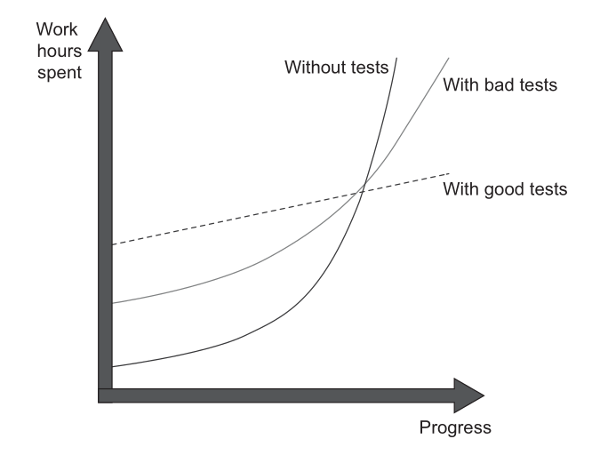
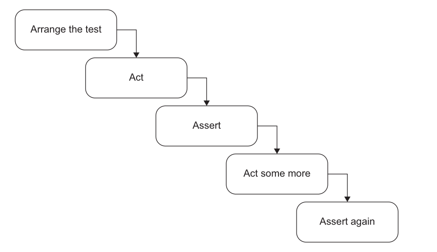

---
delivery date:
  - "[[2025-09-22]]"
---
## Big picture
### What is a unit test?
A unit test is an automated test that
- Verifies a single unit of behaviour,
- Does it quickly,
- and  does it in isolation from other tests.
---

### Cost vs Benifit
The cost component is determined by the amount of time spent on various activities:
- Refactoring the test when you refactor the underlying code
- Running the test on each code change
- Dealing with false alarms raised by the test
- Spending time reading the test when you’re trying to understand how the
underlying code behaves
---

### Good tests vs bad tests vs no tests




---
### Production code vs test code

> ==Code is a liability, not an asset.== The more code you introduce, the more you extend the surface area for potential bugs in your software, and the higher the project’s upkeep cost. It’s always better to solve problems with as little code as possible. ==Tests are code, too. You should view them as the part of your code base that aims at solving a particular problem: ensuring the application’s correctness.== Unit tests, just like any other code, are also vulnerable to bugs and require maintenance.

---
### Test coverage metric
This metric shows the ratio of the number of code lines executed by at least
one test and the total number of lines in the production code base.

$$\text{Code coverage (test coverage)} = \frac{\text{Lines of code executed}}{\text{Total number of lines}}$$

- Coverage metrics are a good negative indicator, but a bad positive one. 
- ==Low coverage numbers—say, below 60%—are a certain sign of trouble.== They mean there’s a lot of untested code in your code base. 
- But ==high numbers don’t mean anything.==

---
### What makes a successful test suite?
A successful test suite has the following properties:
- It’s integrated into the development cycle.
- It targets only the most important parts of your code base.
- It provides maximum value with minimum maintenance costs.
---

## Anatomy of a unit test
---
### Arrange-Act-Assert
Each test is divided into three distinct sections:

• **Arrange:** This section is responsible for bringing the System Under Test (SUT) and all its dependencies into the desired state required for the test.
• **Act:** In this section, a method is called on the SUT to trigger the specific behavior being tested. The output or result of this action is captured.
• **Assert:** This final section verifies that the outcome of the `Act` section matches expectations. This can involve checking a return value, the final state of the SUT or its collaborators, or methods called on those collaborators.

---
Example:

```c++
TEST(SnakeBehaviour, NextHeadLeft) {

// arrange
pair<int, int> current = make_pair(rand() % 10, rand() % 10);
// act
pair<int, int> next_head = get_next_head(current, 'l');
// assert
EXPECT_EQ(next_head,make_pair(current.first,current.second-1));
}
```

---
### Anti-Patterns to Avoid
---

#### Multiple AAA Sections:** 


- Such a test is no longer a unit test but an integration test. It should be refactored by extracting each `Act` into its own distinct test.
	    ◦ **Exception:** This structure is sometimes acceptable as an optimization for slow integration tests where system states naturally flow from one to the next. It is not appropriate for unit tests.


---

#### if statements 
Tests should be a simple, linear sequence of steps with no branching. ==An `if` statement indicates the test is verifying too many things at once and must be split into multiple, more focused tests.== This rule applies to both unit and integration tests, ==as branching provides no benefits and only increases maintenance costs.==

---
### How large each section should be?
- ARRANGE section is usually the largest.
- ACT section is usually single line
	- More than single line is a smell. Shows lack of encapsulation
	- When a single business operation requires multiple method calls from the client, it creates the risk of **invariant violations** (e.g., a customer acquires a product, but the inventory is not reduced).
	
---
Bad example: 
```c#
[Fact]
public void Purchase_succeeds_when_enough_inventory()
{
// Arrange
var store = new Store();
store.AddInventory(Product.Shampoo, 10);
var customer = new Customer();
// Act
bool success = customer.Purchase(store, Product.Shampoo, 5);
store.RemoveInventory(success, Product.Shampoo, 5);
// Assert
Assert.True(success);
Assert.Equal(5, store.GetInventory(Product.Shampoo));
}
```
Good example:

```c#
[Fact]
public void Purchase_succeeds_when_enough_inventory()
{
// Arrange
var store = new Store();
store.AddInventory(Product.Shampoo, 10);
var customer = new Customer();
// Act
bool success = customer.Purchase(store, Product.Shampoo, 5);
// Assert
Assert.True(success);
Assert.Equal(5, store.GetInventory(Product.Shampoo));
}
```
---
### How many assertions in a test?
A unit in unit testing is a unit of behavior, not a unit of code. A single unit of behavior can exhibit multiple outcomes, and ==it’s fine to evaluate them all in one test==.

---

## References
1. [Chapter 3, Unit Testing, Principles Practices and Patterns by Vladimir Khorikov](https://www.manning.com/books/unit-testing) 