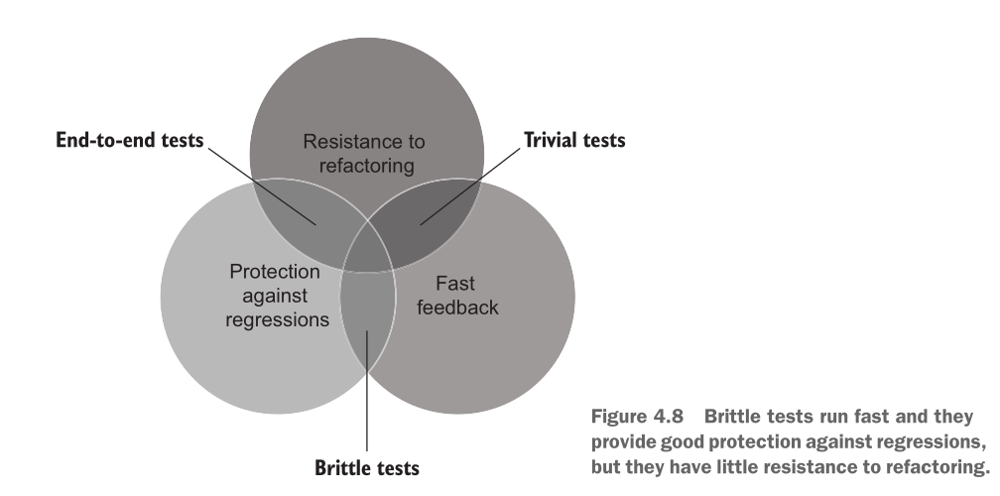

---
delivery date:
  - "[[2025-09-24]]"
---
### Quick recap
- Unit test
- AAA framework
### Agenda 
What makes a good unit test?

---

A good unit test has four foundational attributes that you can use to analyze any
automated test, whether unit, integration, or end-to-end:
- Protection against regressions
-  Resistance to refactoring
- Fast feedback
- Maintainability
---
### Protection against regressions
- A regression is a software bug. It’s when a feature stops working as intended after some code modification, usually after you roll out new functionality.
- Protection against regressions is a measure of how good the test is at indicating the presence of bugs (regressions). 
- Take into account following:
	- The *amount of code* that is executed during the test
	-  The *complexity* of that code
	-  The code’s *domain significance*

---
### Resistance to refactoring
- Refactoring means *changing existing code without modifying its*
*observable behavior*.
-  Resistance to refactoring is the degree to which a test can sustain application code
refactoring **without producing a false positive.**
---
**What causes False positive?**
The more the test is coupled to the implementation details of the system
under test (SUT), the more false alarms it generates. The only way to reduce the
chance of getting a false positive is to decouple the test from those implementation
details.

---
#### Effects of false positives
- They dilute your ability and willingness to react to problems in code, because
you get accustomed to false alarms and stop paying attention to them.
- They diminish your perception of tests as a reliable safety net and lead to los-
ing trust in the test suite.

--- 
### Fast feedback
Fast feedback is a measure of how quickly the test executes.

---
### Maintainability
Maintainability consists of two components:
- How hard it is to understand the test. The smaller the test, the more read-
able it is.
- How hard it is to run the test. The fewer out-of-process dependencies the test
reaches out to, the easier it is to keep them operational.

---
### Trade offs

---
## References
1. [Chapter 4, Unit Testing, Principles Practices and Patterns by Vladimir Khorikov](https://www.manning.com/books/unit-testing) 