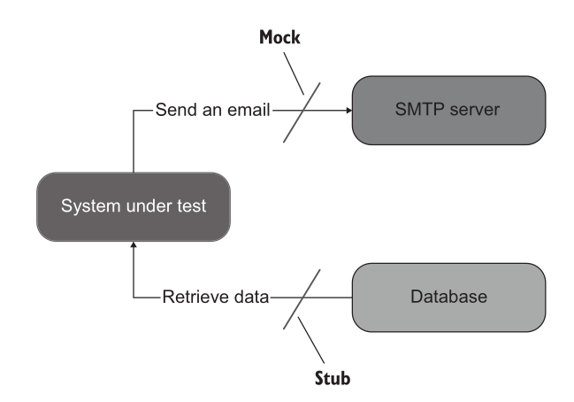
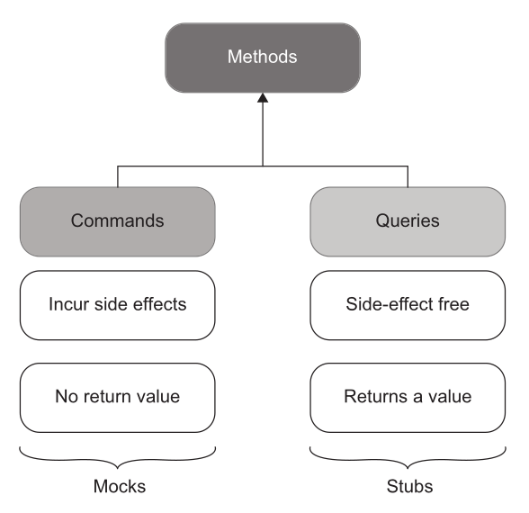
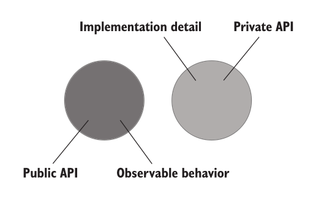
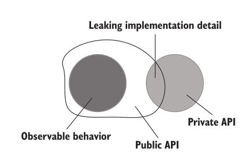
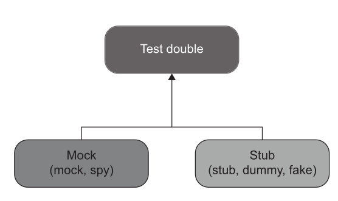

---
delivery date:
  - "[[2024-10-01]]"
---
### Quick recap
- Attributes of a good unit test
	-  Protection against regressions
	-  Resistance to refactoring
	- Fast feedback
	- Maintainability
---
### Agenda
- Testing with external dependencies
---
### Challenges with external dependencies
When your code depends on _external systems_ (databases, third-party APIs, file systems, message queues, etc.), you face a few challenges:
- External systems can be **slow**.
- They can be **unreliable** or rate-limited.
- They can make tests **hard to reproduce**.
- They can add **setup/teardown complexity**.

---
### Strategies for Testing Code with External Dependencies
1. Abstraction via Interfaces
2. Test Doubles for Third-Party APIs
3. Using  Mocks and Stubs

---
#### Abstraction via Interfaces
- Wrap external services behind an interface or adapter.
- Your main code talks only to the interface, not directly to the external system.
- During testing, you substitute the real dependency with a **fake**, **stub**, or **mock**.

Refer example [here](../code/mock_stubs/tests/order_test_real_objects.cpp#L14)

---

#### Test Doubles for Third-Party APIs
- Use libraries like **WireMock** (Java), **httpretty** (Python), or **responses** (Python) to simulate API servers.
- You predefine responses for certain requests, so tests don’t hit the real API.

---
#### Mocks and Stubs

- Mocks help to **emulate and examine outcoming interactions**. These interactions are calls the SUT makes to its dependencies **to change their state**.
- Stubs help to **emulate** incoming interactions. These interactions are calls the SUT makes to its dependencies **to get input data.** 


---
 

---
### Commands vs queries
- **Commands** are methods that **produce side effects** and don’t return any value (return void).
- Examples of side effects include
mutating an object’s state, changing a file in the file system, and so on. 

- **Queries** are side-effect free and **return a value**.

---


---
###  Code separation
- All production code can be categorized along two dimensions:
-  **Public API vs. private API** (where API means application programming interface)
-  **Observable behavior vs. implementation details**

---
#### Public vs private API
Usually differentiated by public methods of a class vs private, protected members

---
#### Observable behaviour vs implementation detail
- For a piece of code to be part of the system’s observable behavior, it has to do one of the following things:
	-  **Expose an operation that helps the client achieve one of its goals.** An operation is a method that performs a calculation or incurs a side effect or both.
	-  **Expose a state that helps the client achieve one of its goals.** State is the current condition of the system.  
- Any code that does neither of these two things is an implementation detail.

---
#### Well designed API


---
#### Leaky API design


---
#### example leaky design 
```c#
public class User
{
	public string Name { get; set; }
	public string NormalizeName(string name){
		string result = (name ?? "").Trim();
		if (result.Length > 50){
			return result.Substring(0, 50);
		}
	return result;
}
}
```

```c#
public class UserController{
	public void RenameUser(int userId, string newName){
		User user = GetUserFromDatabase(userId);
		//string normalizedName = user.NormalizeName(newName);
		user.Name = normalizedName;
		SaveUserToDatabase(user);
}
}
```
---
Refer snake code for leaky API  

---
### Types of test double
- **Dummy** objects are passed around but never actually used. Usually they are just used to fill parameter lists.
- **Fake** objects actually have working implementations, but usually take some shortcut which makes them not suitable for production (an [in memory database](https://martinfowler.com/bliki/InMemoryTestDatabase.html) is a good example).
- **Stubs** provide canned answers to calls made during the test, usually not responding at all to anything outside what's programmed in for the test.
- **Spies** are mocks that also record some information based on how they were called. One form of this might be an email service that records how many messages it was sent.
- **Mocks** are the objects pre-programmed with expectations which form a specification of the calls they are expected to receive.
---


---
Refer code example [here](../code/mock_stubs)

---
#### References
1. [Chapter 5, Unit Testing, Principles Practices and Patterns by Vladimir Khorikov](https://www.manning.com/books/unit-testing) 
2. [Mocks Aren't Stubs](https://martinfowler.com/articles/mocksArentStubs.html)
3. [gMock for Dummies | GoogleTest](https://google.github.io/googletest/gmock_for_dummies.html)
4. [gMock Cookbook | GoogleTest](https://google.github.io/googletest/gmock_cook_book.html)
5. [gMock Cheat Sheet](https://android.googlesource.com/platform/external/googletest/+/refs/heads/main-cg-testing-release/docs/gmock_cheat_sheet.md)
 
---

