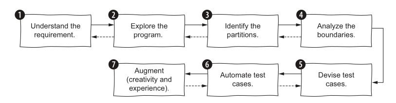

---
delivery date:
  - "[[2025-10-27]]"
---
## Project evaluation criteria
**Cieling:**
- If you have a working project which is deployed, hosted and  people outside your team are using it you get graded out of 10.
- Else if you have a working MVP project(deployed with key functionalities working), then you get graded out of 8.5.
- Else you get graded out of 7.
**Expectations:**
- Design docs upto date with the code(iun sync with code)
- *Test coverage:* Key functionalities are covered under tests (Path to test file folder with an markdown file summarising the tests)
- *Commentary on your design decisions*(Make Design md  file) to jot down following:
	- How you have improved design of software.
	- Where you have applied what design principles?
	- Key refactoring you have done to improve the design of your project
---
## Quick recap
- Testing with external dependencies
- Test Doubles
	- mock, stub, spy, dummies, fake

---
## Agenda
- How to derive test cases?
---
## Types of Unit Test
1. Specification tests
2. Boundary tests
3. Property-Based Testing
4. Structural Testing
---
## Specification based tests

---
Here’s a concise summary of the testing process described:

---

### **Steps for Specification-Based Testing**

1. **Understand the Requirements**
    - Grasp what the program should and shouldn’t do.
    - Identify input/output variables, their types, domains, and corner cases.
2. **Explore the Program**
    - Experiment with different inputs to understand its behavior.
    - Build a mental model of how the program works.
3. **Identify Input and Output Partitions**
    - Analyze each input’s type and valid range.
    - Study dependencies between variables.
    - Consider all possible output types and implicit business rules.
4. **Find Boundaries**
    - Focus on edge cases, as bugs often occur at partition boundaries.
5. **Design Test Cases**
    - Combine partitions and boundary conditions strategically.
    - Avoid unnecessary combinations by testing exceptional cases only once.
6. **Automate the Tests**
    - Write automated tests with clear inputs and expected outputs.
    - Keep test code clean, maintainable, and easy to debug.
7. **Refine with Creativity and Experience**
    - Review the test suite for gaps.
    - Add additional cases based on intuition or domain knowledge.
---
Here’s a **concise summary** of Section 2.4 (“Specification-based testing in the real world”) — capturing its **key lessons and principles**:

---

### Specification-Based Testing in Practice

1. **Iterative, not sequential:**  
    The process of deriving test cases is **cyclic** — you often go back to refine partitions or boundaries while writing tests.
2. **Depth of testing depends on risk:**  
    Test **critical or high-risk areas** more thoroughly; be pragmatic where the cost of failure is low.
3. **Partition vs. boundary — don’t overthink it:**  
    It doesn’t matter whether a case is seen as a partition or a boundary — what matters is that it’s **tested**.
4. **On/off points are usually enough:**  
    Testing **boundary values** (“on” and “off” points) covers most cases, though adding extra “in/out” points can improve understanding.
5. **Use variations of a base input:**  
    Use a **common input seed** (like `"abc"`) and make small tweaks to derive multiple test cases — this simplifies analysis and debugging.
6. **Control combinatorial explosion:**
    - Reduce combinations by isolating exceptional cases.
    - Split large methods into smaller, testable units when combinations grow too large.
7. **Keep test inputs simple:**  
    Use the **simplest possible values** (small integers, short strings) unless complexity is necessary for coverage.
8. **Use realistic placeholders for irrelevant inputs:**  
    When certain inputs don’t affect behavior, use **reasonable, realistic defaults**.
9. **Test nulls and exceptions contextually:**  
    Only test null or edge cases **when they can realistically occur** in that component’s context (e.g., UI vs. internal logic).
10. **Use parameterized tests for repetitive cases:**  
    Avoid duplication by grouping similar tests using **parameterized frameworks**.
11. **Applies at all levels of granularity:**  
    The same partitioning and boundary reasoning applies to **methods, classes, and larger systems** (unit or integration tests).
12. **Include class state in OOP testing:**  
    When testing **stateful classes**, consider both **input parameters** and **object state** before invoking methods.
13. **Experience and creativity still matter:**  
    Systematic steps help, but experienced testers will design **better, more focused tests** based on intuition and domain insight.

---
## Excercise
1.Implement adder : https://leetcode.com/problems/add-strings
1. Write specification based test cases for the same

---
## References
1. Chapter 2, Effective Software testing by MAURÍCIO ANICHE
