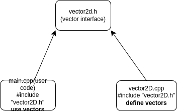

---
delivery date:
  - "[[2025-07-24]]"
---

#### Quick recap
- Design in Software Process
- Conceptual design vs Technical design 
- CRC
---
#### Agenda
- Programming paradigms
	- Procedural vs Modular vs OOP vs Generic Programming

---
#### Programming Paradigms
- Procedural programming
- Modular programming
- Object Oriented Programming
- Generic Programming
---


---
#### Procedural Programming

> Decide which procedures you want;
> Use the best algorithms you can find.

- Language supports this paradigm by providing facilities for passing arguments to functions and returning values from functions.  

Refer code: [procedural code](../code/lecture3/procedural)


---
#### Scope of improvement(1)
 1. [**namespace pollution**](https://cpp-primer.pages.dev/book/172-18.2._namespaces.html#filepos4928745) Occurs when all the names of classes and functions are placed in the global namespace. Large programs that use code written by multiple independent parties often encounter collisions among names if these names are global.
 2. Separation of concern: User code is not separated from programmers" code

---
#### Modular programming

> Decide which modules you want;
> partition program so that data is hidden within modules.

Refer [modular code](..code/lecture3/modular)

---
#### Namespaces
**[Namespaces](https://cpp-primer.pages.dev/book/175-defined_terms.html#filepos5111084)** provide a much more controlled mechanism for preventing name collisions. Namespaces partition the global namespace. A namespace is a scope. By defining a library’s names inside a namespace, library authors (and users) can avoid the limitations inherent in global names.


---


---
#### Multi-file compilation
C++ like C supports C"s notion of separate compilation. This can be used to organise a program into a set of semi-independent fragments.

---
#### How does multi compilation works?
1. **Preprocessor** processes each source file and act upon preprocessor directives(hash directives). (test.cpp => test.i)
2. **Compiler** takes in the resultant source file and compile it to assembly code. (test.i => test.s)
3. **Assembler** takes in the assembly file and convert it into a relocatable object code. (test.s => test.o)
4. **Linker** takes multiple object files and generate a single executable file (test.o => test.out)

---

Linker positioned in compilation process.  
Pic credits: CSAPP

---
```bash
# preprocessing
g++ -E main.cpp -o main.i
g++ -E vector2D.cpp -o vector2D.i
## compilation
g++ -S main.i -o main.s
g++ -S vector2D.i -o vector2D.s
# Assembly
g++ -c main.s -o main.o
g++ -c vector2D.s -o vector2D.o
#Linking 
g++ main.o vector2D.o -o vector_program

# or in one step
g++ main.cpp vector2D.cpp -o vector_program 
```
---
#### Scope of improvement(2)
1. Information organisation
2. Code reuse
---
#### Object Oriented Programming

Refer [oop code](../code/lecture3/oop)

---
#### Information organization

---
#### Code reuse
1. Rewriting vs extension

---

### Generic Programming

> Decide which algorithms you want;
> parameterize them so that they work for
> a variety of suitable types and data structures.

Refer [generic code](../code/lecture3/generic)

---
#### References
1. [Chapter 3: C++ Programming Language - Bjarne Stroustrup]()
