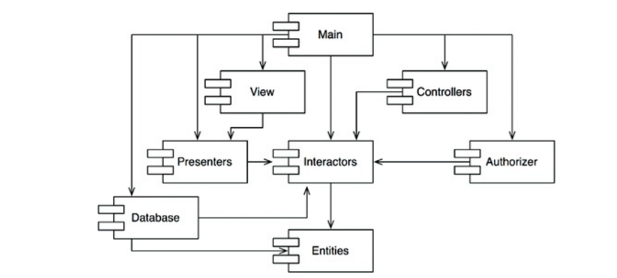
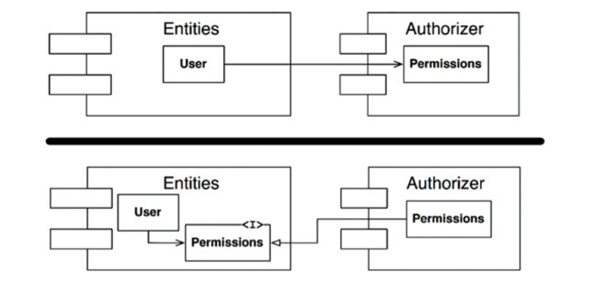
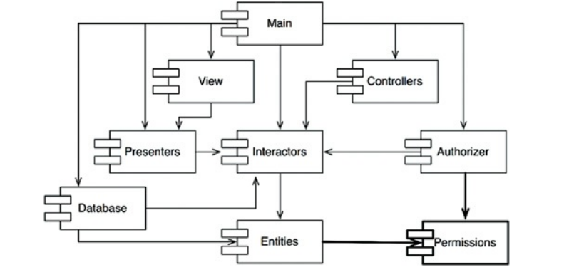
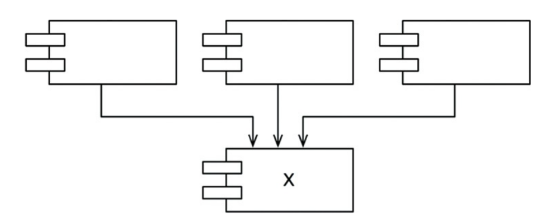

---
delivery date:
  - "[[2025-08-18]]"
---
#### Agenda
- Component coupling
	- Acyclic dependency principle
	- Stable dependencies principle
	- Stable abstractions principle
---
### Acyclic dependency principle
Problem: **The 'Morning After Syndrome'**
- Someone changes a component you depend on → build breaks
- Leads to instability in the build, with teams constantly trying to adapt to others' latest changes.
---
#### Solution 1:  Weekly builds
- isolated development for most of the week, integrate code on Fridays
- Pro:
	- Simple to follow
- Con:
	- Once the size of software grows, heavier integration penalties are incurred.  
---
#### Solution 2: Eliminate cyclic dependencies
- The solution lies in partitioning the development environment into _releasable components_.
- Each **component becomes a "unit of work"** for a developer or team.
- Once a component is working, it's released with a version number for other teams to use. **Developers continue private modifications while others use the released version.**
- This approach ensures "no team is at the mercy of the others," as teams can decide when to adopt new releases, allowing "integration happens in small increments."
---

Image credits: Clean Architecture

---
##### Cyclic dependencies
- A dependency cycle means components "have, in effect, become one large component," leading to the "dreaded 'morning after syndrome'" for all involved teams.
- Cycles make it "very difficult to isolate components," leading to challenges in unit testing, releasing, and geometrically increasing build issues.
- It also makes it "very difficult to work out the order in which you must build the components," and in some languages, "there probably is no correct order."
---

---
##### How to fix cycles
1. **Dependency Inversion Principle (DIP):** Introduce an interface in the "lower-level" component (e.g., Entities) that the "higher-level" component (e.g., Authorizer) depends on, inverting the original dependency.

---

1. **New Component Creation:** Create a new component that both previously cyclically dependent components now depend on, moving the mutually used classes into this new component.

---
## The Stable Dependencies Principle (SDP)

Rule: **"Depend in the direction of stability."** 
This principle aims to ensure that "modules that are intended to be easy to change are not depended on by modules that are harder to change."

---
Stable vs unstable Components

| Unstable component                                                                                                                           | Stable component                                                                                                                                                |
| -------------------------------------------------------------------------------------------------------------------------------------------- | --------------------------------------------------------------------------------------------------------------------------------------------------------------- |
| - easy to incur change => unstable - A component with no incoming dependencies but many outgoing dependencies is "very unstable."   | - difficult to change => stable -- A component with "lots of incoming dependencies is very stable" because changes require reconciling with many dependents. |
|                                                                                      |                                                                                                           |

---
**Stability Metrics:**

- **Fan-in:** Number of classes outside this component that depend on classes within it. (Incoming dependencies)
- **Fan-out:** Number of classes inside this component that depend on classes outside it. (Outgoing dependencies)
- **I (Instability):** I = Fan-out / (Fan-in + Fan-out).
- Range: [0, 1]
- **I = 0:** Maximally stable (high Fan-in, zero Fan-out). "Responsible and independent." Hard to change, no dependencies to force change.
- **I = 1:** Maximally unstable (zero Fan-in, high Fan-out). "Irresponsible and dependent." No reason not to change, ample external reasons to change.

---
The SDP dictates that "the I metric of a component should be larger than the I metrics of the components that it depends on," meaning "I metrics should decrease in the direction of dependency."
**Violation:**
- A **stable, core component** like `DatabaseLayer` depends on a **volatile, changing component** like `UI`.
- When the UI changes, database code must also be rebuilt.
**Adherence:**
- `UI` depends on `DatabaseLayer`, not the other way around.
---
## The Stable Abstractions Principle (SAP)

**"A component should be as abstract as it is stable."**

High-level policies and architectural decisions should reside in stable components (I=0) to resist volatility.
However, if stable components contain concrete code, they become inflexible.

The solution aligns with the Open/Closed Principle (OCP): Stable components should consist of "abstract classes and interfaces" so they can be "extended without requiring modification."

---

B. Relationship between Stability and Abstractness:

The SAP establishes a relationship between a component's stability (I) and its abstractness (A).
**A (Abstractness):** A = Na ÷ Nc (Number of abstract classes and interfaces / Total number of classes).
Range: [0, 1]
**A = 0:** No abstract classes.
**A = 1:** Contains only abstract classes.
Combined, the SDP and SAP represent the DIP at the component level: "dependencies run in the direction of abstraction." Unlike class-level DIP (binary abstract/concrete), components can be "partially abstract and partially stable."

---

- **Zones of Exclusion:Zone of Pain (near 0, 0):** Highly stable (I=0) and concrete (A=0). These components are "rigid." They "cannot be extended because it is not abstract, and it is very difficult to change because of its stability." Volatile components in this zone are especially problematic (e.g., database schemas).
- **Zone of Uselessness (near 1, 1):** Maximally abstract (A=1) yet has no dependents (I=1). Such components are "useless," often "leftover abstract classes that no one ever implemented."

---
#  References
1. Chapter 14 (Clean Architecture)